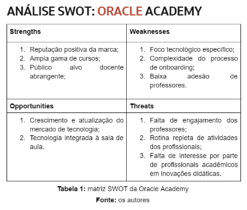
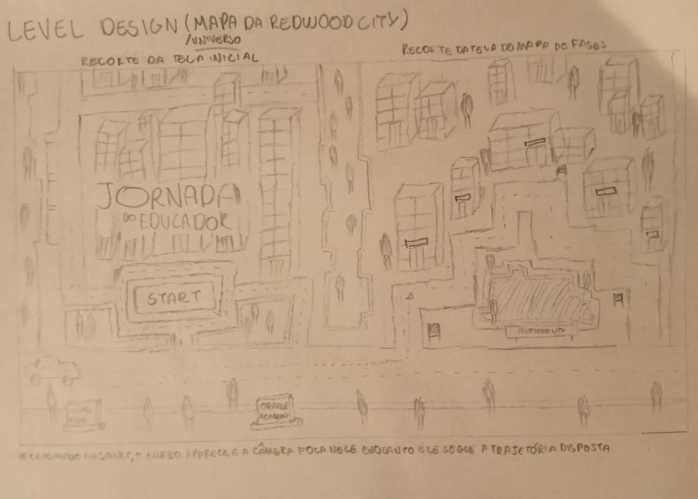
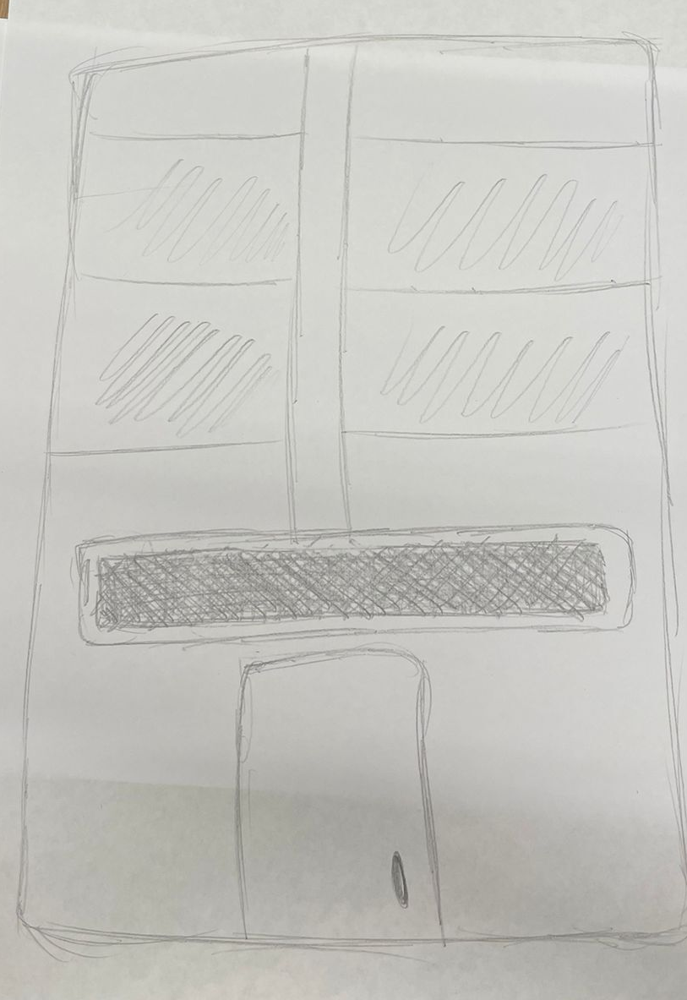
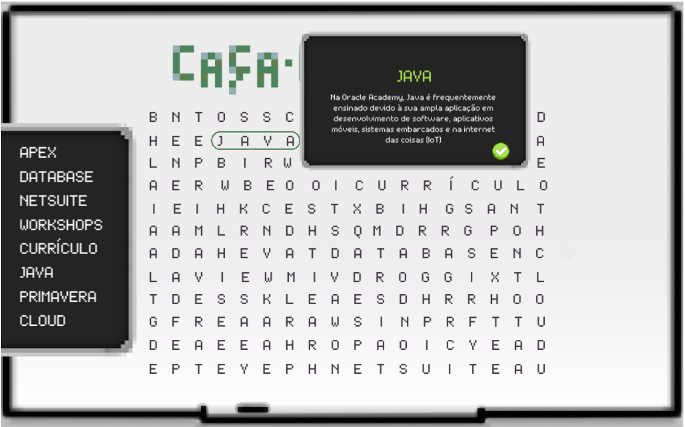
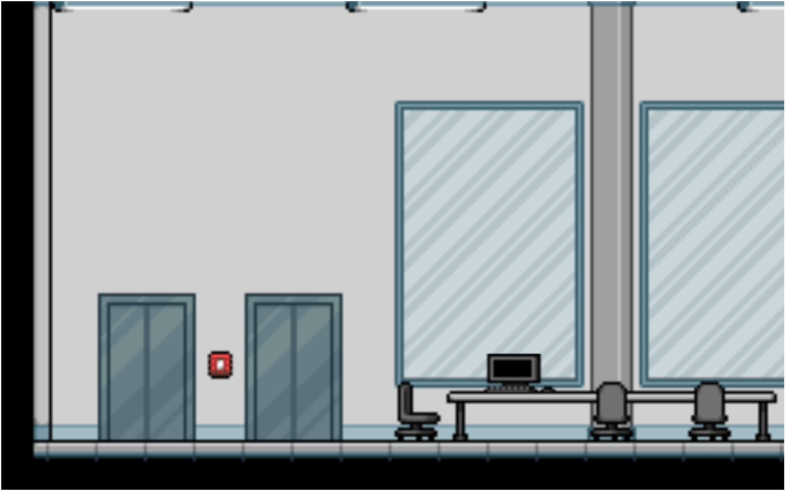

</div>

# GDD - Game Design Document - Módulo 1 - Inteli

## GOAT Team (Gamifying Oracle Academy for Teachers) - Jornada do Educador

#### Davi Nascimento de Jesus, Isabelle Messias Dantas Pereira, Fernando Tavares Bertholdo, João Gabriel de Ouro Presto, Kauã Rodrigues dos Santos e Moyses Birman Anijar.

## Sumário

[1. Introdução](#c1)

[2. Visão Geral do Jogo](#c2)

[3. Game Design](#c3)

[4. Desenvolvimento do jogo](#c4)

[5. Casos de Teste](#c5)

[6. Conclusões e trabalhos futuros](#c6)

[7. Referências](#c7)

[Anexos](#c8)

<br>


# <a name="c1"></a>1. Introdução 

## 1.1. Escopo do Projeto

&nbsp;&nbsp;&nbsp;&nbsp;Nessa primeira seção, será abordado o escopo de um projeto, o qual se refere essencialmente clara e abrangente do que será incluído e excluído no trabalho ao decorrer do projeto. Assim, estabelece os principais limites, objetivos e entregas do projeto, delineando o que será realizado para atender aos requisitos específicos do parceiro, nesse caso, a Oracle Academy.


### Contexto da indústria 

&nbsp;&nbsp;&nbsp;&nbsp;No ano de 1997, a Oracle Corporation fundou a Oracle Academy (OA) para impulsionar o ensino de computação globalmente, formando cada vez mais profissionais na área. Desse modo, a Oracle Academy oferece um ampla gama de cursos e treinamentos gratuitos para professores se aperfeiçoarem no ensino de habilidades digitais em suas instituições educacionais.

&nbsp;&nbsp;&nbsp;&nbsp;No cenário atual da educação, a tecnologia desempenha um papel crucial, moldando significativamente as tendências do mercado. A ascensão da aprendizagem online e da educação à distância, aliada ao surgimento das EdTechs, empresas que objetivam reinventar os métodos de aprendizado e facilitar o conhecimento (XP Educação, 2022), está proporcionando acesso sem precedentes a recursos educacionais e métodos de ensino inovadores. A personalização e adaptabilidade, impulsionadas pela inteligência artificial, estão transformando a maneira como os alunos aprendem, oferecendo experiências de aprendizado sob medida para suas necessidades individuais.

&nbsp;&nbsp;&nbsp;&nbsp;Nesse contexto, apesar de existir muitos cursos voltados à tecnologia e computação no mercado, poucos são direcionados exclusivamente para educadores, destacando a formação da Oracle Academy. De abrangência internacional, a Oracle Academy abarca cerca de 160 países, e se enquadra no contexto de prestadora de serviços na área da tecnologia interseccionada com as ciências da educação corporativa. Nesse nicho empresarial, destacam-se outras grandes empresas que são notáveis, como a Microsoft, que possui um nicho semelhante, bem como a Affero Lab especializada em treinamentos de educação corporativa.

&nbsp;&nbsp;&nbsp;&nbsp;Como concorrentes de destaque da Oracle Academy, tanto a Microsoft quanto a Affero Lab se destacam no mercado de educação corporativa e tecnologia, cada uma com abordagens distintas. Enquanto a Microsoft concentra-se em capacitar educadores para integrar a tecnologia de forma eficaz em suas práticas pedagógicas, por meio de programas como o Microsoft Educator Center e iniciativas de responsabilidade social, a Affero Lab se destaca por oferecer soluções de treinamento customizadas para empresas, adotando uma abordagem centrada no aluno e fazendo uso de metodologias inovadoras e parcerias estratégicas para garantir a relevância e atualização constante de seus cursos e conteúdos.

&nbsp;&nbsp;&nbsp;&nbsp;Porém, mesmo entre elas, a Oracle Academy se destaca por oferecer uma abordagem abrangente para a educação em tecnologia, especialmente no campo da computação e ciência da computação. Enquanto a aprendizagem online e as EdTechs são excelentes recursos, a Oracle Academy fornece uma combinação única de recursos, incluindo currículos educacionais padronizados, materiais didáticos de alta qualidade e acesso a tecnologias avançadas da Oracle, como bancos de dados, computação em nuvem e desenvolvimento de software. Tudo centralizado no docente e em como ele faria a integração dessas oportunidades na sua sala de aula.
### Análise setorial (5 Forças de Porter)

&nbsp;&nbsp;&nbsp;&nbsp;As 5 Forças de Porter é um framework de contextualização empresarial criado por Michel Porter na década de 70. O modelo permite fazer uma análise setorial dos principais concorrentes, atores e forças que se relacionam dentro de um mercado (Casarotto, 2020). Ela analisa 5 aspectos principais: a rivalidade com os concorrentes existentes, o poder de negociação dos fornecedores, o poder de barganha dos consumidores, a ameaça de novos entrantes e a ameaça de produtos substitutos.

&nbsp;&nbsp;&nbsp;&nbsp;Diante desse contexto, é primordial desenvolver essa análise para que seja possível observar o posicionamento da empresa em relação ao setor que ela participa. Assim, no contexto da Oracle Academy, que se vincula ao segmento de educação corporativa, tem-se que:

**Rivalidade entre concorrentes existentes**

&nbsp;&nbsp;&nbsp;&nbsp;No mercado brasileiro de educação corporativa, a competição é um aspecto sempre presente, com várias empresas disputando participação de mercado. Por exemplo, a Affero Lab, a maior empresa de educação corporativa do Brasil, enfrenta competição direta da Crescimentum e da HSM Educação, ambas conhecidas por oferecerem treinamentos e soluções de desenvolvimento para empresas de diversos setores. Essas empresas frequentemente competem com base na qualidade do conteúdo oferecido, na abrangência dos serviços, na reputação da marca e nos preços competitivos.

&nbsp;&nbsp;&nbsp;&nbsp;Mesmo nesse cenário, porém, a Oracle Academy se destaca como uma influente provedora de soluções educacionais, especialmente no campo da tecnologia da informação. Enquanto outras empresas competem com uma variedade de serviços, a Oracle Academy se concentra principalmente em oferecer treinamento e certificação em tecnologias Oracle, como bancos de dados, desenvolvimento de software e computação em nuvem. Seu posicionamento como especialista em tecnologia a torna uma escolha preferencial para empresas que buscam treinamento nesses domínios específicos.

**Poder de negociação dos fornecedores**

&nbsp;&nbsp;&nbsp;&nbsp;Os fornecedores no setor de educação corporativa incluem instrutores, consultores, desenvolvedores de conteúdo e provedores de tecnologia. Empresas como a Veduca e a Affero Lab dependem desses fornecedores para fornecerem cursos e materiais de treinamento de alta qualidade. No entanto, fornecedores especializados, como consultores renomados ou desenvolvedores de tecnologia de ponta, podem ter mais poder de negociação. Por exemplo, um consultor de renome nacional pode impor preços mais altos devido à sua reputação estabelecida no mercado.

&nbsp;&nbsp;&nbsp;&nbsp;No que diz respeito ao poder de negociação dos fornecedores, a Oracle Academy pode ter uma posição forte devido à sua reputação e especialização em tecnologia Oracle. Seus instrutores e desenvolvedores de conteúdo podem ter mais poder de barganha em comparação com fornecedores mais genéricos. Além disso, a Oracle tem recursos substanciais para investir em desenvolvimento de conteúdo e tecnologia educacional, o que lhes confere uma vantagem adicional em termos de qualidade e inovação.

**Poder de barganha dos consumidores**

&nbsp;&nbsp;&nbsp;&nbsp;Grandes empresas no Brasil, como Petrobras, Ambev e Vale, têm um considerável poder de negociação no mercado de educação corporativa devido ao volume de treinamento, principalmente com o aumento expoente de áreas de tecnologia, que necessitam para seus funcionários. No entanto, empresas de médio e pequeno porte podem ter menos poder de negociação. Por exemplo, uma startup em crescimento pode não ter o mesmo poder de barganha em termos de preços ou serviços personalizados que uma grande corporação teria.

&nbsp;&nbsp;&nbsp;&nbsp;Instituições que dependem da tecnologia Oracle, como bancos, empresas de telecomunicações e varejistas, podem ter um poder de negociação significativo com a Oracle Academy, devido à necessidade crítica de treinamento em suas plataformas e tecnologias. No entanto, para empresas que não têm uma dependência tão forte da tecnologia Oracle, o poder de negociação pode ser mais equilibrado. A Oracle Academy pode oferecer pacotes personalizados ou descontos para garantir a fidelidade de seus clientes.

&nbsp;&nbsp;&nbsp;&nbsp;Além disso, isso se reflete também no seu principal público-alvo: os professores. Docentes que utilizam de tecnologias Oracle são muito mais propensos a desejarem participar, sem restrições, da Oracle Academy do que docentes que fazem uso de outras tecnologias. 

**Ameaça de novos entrantes**

&nbsp;&nbsp;&nbsp;&nbsp;Embora a entrada no mercado de educação corporativa no Brasil possa ser desafiadora devido aos altos custos iniciais e à necessidade de estabelecer credibilidade, novas empresas estão constantemente surgindo, impulsionadas pela demanda crescente por soluções de treinamento e desenvolvimento. Por exemplo, a Revelo, uma startup brasileira, entrou no mercado oferecendo uma plataforma de recrutamento que também oferece treinamento personalizado para empresas. A facilidade de acesso à tecnologia e a disponibilidade de capital de investimento também podem encorajar novas entradas no mercado.

&nbsp;&nbsp;&nbsp;&nbsp;Embora a Oracle Academy seja uma presença estabelecida no mercado de educação corporativa em tecnologia, a entrada de novos concorrentes ainda é uma possibilidade. No entanto, a reputação consolidada da Oracle na indústria de tecnologia e seus recursos substanciais podem representar barreiras significativas para novos entrantes. Além disso, a Oracle Academy continua a inovar em seus métodos de entrega de treinamento e a expandir sua gama de cursos, mantendo assim sua posição competitiva.

**Ameaça de produtos substitutos**

&nbsp;&nbsp;&nbsp;&nbsp;No ambiente digital atual, a ameaça de produtos substitutos é significativa. Plataformas de e-learning gratuitas, como Coursera e Udemy, oferecem uma ampla variedade de cursos que podem ser acessados a qualquer momento e em qualquer lugar, representando uma concorrência direta para empresas de educação corporativa. Além disso, algumas empresas optam por desenvolver internamente programas de treinamento específicos para suas necessidades, reduzindo assim a dependência de fornecedores externos. 

&nbsp;&nbsp;&nbsp;&nbsp;Em relação aos produtos substitutos, a Oracle Academy enfrenta uma competição significativa de plataformas de e-learning que oferecem cursos de tecnologia de diversas fontes. Dentre essas, destaca-se o Google for Education - Training Center, que não somente integra o professor às tecnologias Google, e às mais utilizadas no mercado, mas já possui uma própria estratégia de onboarding do docente e, também, viabiliza a ele o acesso ao sistema cloud. No entanto, a especialização da Oracle Academy em tecnologia própria, Oracle, caracteriza-se como uma vantagem distintiva, especialmente para empresas que buscam treinamento específico em suas soluções. A empresa continua a se diferenciar através do desenvolvimento de conteúdo exclusivo e parcerias estratégicas com empresas e instituições de renome.

&nbsp;&nbsp;&nbsp;&nbsp;O desenvolvimento da análise disposta é importante para não somente apresentar o mercado e o nicho setorial que é ocupado pela Oracle Academy, mas também apresentar as suas únicas contribuições que a fazem ser relevante nesse setor.

### Análise SWOT

&nbsp;&nbsp;&nbsp;&nbsp;A matriz SWOT surge como uma ferramenta de gestão empresarial, a qual tem como premissa fundamental a análise de seus atributos, denominados pelos acrônimos (S - Strengths) W - Weaknesses; O - Opportunities; T - Threats), ou seja, das forças e fraquezas, das ameaças e oportunidades de uma organização ou projeto. Nesse sentido, Bjorn (2008) atesta que as forças e fraquezas se referem ao ambiente interno do fator analisado, ou seja, aquilo que depende de ações internas para ser melhorado. Ademais, as ameaças e as oportunidades se referem aquilo que não depende de ações diretas dos gestores para a melhoria de tal projeto, visto que tais fatores são decorrentes do ambiente externo. Portanto, as forças e as fraquezas são alinhadas às oportunidades e ameaças para definir os focos de intervenção e do que se pode tirar proveito, buscando aperfeiçoar o negócio. (Filho, 2014)


&nbsp;&nbsp;&nbsp;&nbsp; Nesse contexto, para maior elucidação, as forças são as capacidades próprias, internas à empresa, que contribuem para seu crescimento, podem ser, por exemplo, as qualidades, as habilidades ou até mesmo os pontos de vista dos membros empregados que auxiliam a empresa a melhorar constantemente. Ademais, as oportunidades, também nesse nicho de ser favorável ao desenvolvimento empresarial, são os pontos externos que propiciam o seu crescimento, como parcerias de negócios, contratos favoráveis, aumento de interesse dos clientes, todos esses são valores externos que transformam positivamente a posição da empresa no mercado.


&nbsp;&nbsp;&nbsp;&nbsp;Na perspectiva contrária, as fraquezas são os pontos internos que desconstroem ou desaceleram as métricas de crescimento, as possíveis causas para esse cenário podem ser metodologias ineficazes, pessoas não alinhadas aos projetos e missão da empresa acabam por prejudicar esse crescimento e dificultar os posteriores desenvolvimentos. Outrossim, as fraquezas configuram-se pelas abordagens externas que são maléficas e prejudiciais para os objetivos da empresa, como restrições governamentais, mudanças em instituições sociais e greves que entram nesse processo e devem ser identificadas como um foco de intervenção.

&nbsp;&nbsp;&nbsp;&nbsp;Logo, a análise dos ambientes externos e internos contribuem para uma melhor visualização do projeto analisado podendo, assim, definir se é viável ou não a sua realização, como também o que deve ser aprimorado.

&nbsp;&nbsp;&nbsp;&nbsp;Seguindo a lógica discorrida, abaixo, na figura 1, se encontra a matriz desenvolvida para representar a Oracle Academy (OA): <br><br>

<div align="center" width="100%">
 <sub>Figura 1: Análise Swot da Oracle Academy</sub><br>
 
 
 
 <sup>Fonte: Material produzido pelos autores (2024)</sup>
</div>

&nbsp;&nbsp;&nbsp;&nbsp;Assim, conforme a figura 01, nota-se que as forças mostradas pela Oracle Academy se refletem na reputação positiva da marca, na ampla gama de cursos e no público alvo docente abrangente. As fraquezas, por sua vez, no foco tecnológico específico, na complexidade do processo de onboarding e na baixa adesão de professores.

&nbsp;&nbsp;&nbsp;&nbsp;Quando se toca ao âmbito externo, a Oracle Academy apresenta como oportunidades o crescimento e a atualização do mercado de tecnologia, bem como as abordagens tecnológicas integradas à sala de aula. Negativamente, porém, como ameaças, colocam-se a falta de engajamento dos professores, a rotina repleta de atividades dos profissionais e a falta de interesse que eles podem possuir em inovações didáticas.

&nbsp;&nbsp;&nbsp;&nbsp;A seguir, também, a análise SWOT feita para identificar as possibilidades em relação à Jornada do Educador: <br><br>

<div align="center" width="100%">
 <sub>Figura 2: Análise Swot da Jornada do Educador</sub><br>
 
 
 
 <sup>Fonte: Material produzido pelos autores (2024)</sup>
</div>

&nbsp;&nbsp;&nbsp;&nbsp;Dessa forma, conforme a figura 02, nota-se que as forças mostradas pela Oracle Academy se refletem na reputação positiva da marca, na ampla gama de cursos e no público alvo docente abrangente. As fraquezas, por sua vez, no foco tecnológico específico, na complexidade do processo de onboarding e na baixa adesão de professores.

&nbsp;&nbsp;&nbsp;&nbsp;Quando se toca ao âmbito externo, a Oracle Academy apresenta como oportunidades o crescimento e a atualização do mercado de tecnologia, bem como as abordagens tecnológicas integradas à sala de aula. Negativamente, porém, como ameaças, colocam-se a falta de engajamento dos professores, a rotina repleta de atividades dos profissionais e a falta de interesse que eles podem possuir em inovações didáticas.


### 1.1.3. Descrição da Solução Desenvolvida 

&nbsp;&nbsp;&nbsp;&nbsp;  O problema que se busca intervir com o presente artefato consiste no problema de O problema que se busca intervir com o presente artefato consiste no problema de integração dos professores às ferramentas e recursos educacionais da Oracle Academy, a qual é um fator importante para potencializar seu desempenho na sala de aula. No entanto, é notável que enfrenta-se um desafio significativo em relação à dificuldade de adesão contínua dos professores aos recursos da Oracle Academy (OA). 

&nbsp;&nbsp;&nbsp;&nbsp; Nessa conjuntura, a dificuldade enfrentada pelos professores reside na complexidade em descobrir e utilizar da melhor forma todos os recursos oferecidos pela Oracle Academy. Esse fato torna-se evidente, à medida que se analisa a lacuna entre o grande potencial da plataforma e sua adesão e implementação efetiva na plataforma e nas atividades de ensino. Uma vez que, muitos professores, embora estejam cientes da existência desses recursos, enfrentam dificuldades em integrá-los de forma significativa em seus planejamentos letivos e atividades curriculares.

&nbsp;&nbsp;&nbsp;&nbsp; Tendo em vista a relevância dessa problemática, a equipe desenvolveu um projeto com o objetivo de melhorar a adesão dos professores aos recursos da Oracle Academy. Nessa lógica,  a proposta de solução idealizada pela equipe GOAT (Gamifying Oracle Academy for Teachers) consiste no desenvolvimento da Jornada do Educador, um jogo interativo de exploração de um mapa com estrutura de fases desbloqueáveis. O docente poderia progredir linearmente pelas fases estabelecidas, com acesso a uma barra de status e somente podendo alcançar a fase posterior tendo desenvolvido a fase anterior.

&nbsp;&nbsp;&nbsp;&nbsp; Dessa maneira, a solução seria aplicada, primeiramente, com os professores da área de computação no Instituto de Tecnologia e Liderança, Inteli. Assim, se gerar um feedback inicial positivo da sistematização do jogo e englobar os pilares da User Experience idealizados no desenvolvimento, o projeto pode ser implantado de fato para o público-alvo no processo de onboarding da plataforma da Oracle Academy.

&nbsp;&nbsp;&nbsp;&nbsp; Ademais, a jornada do Educador visa colaborar com a seriedade do processo de onboarding na Oracle Academy, enquanto o transforma em uma experiência envolvente e educativa. Ao explorar fases desbloqueáveis, os educadores aprendem progressivamente sobre as ferramentas e recursos disponíveis. Desse modo, essa abordagem proporciona continuidade no aprendizado e fomenta a participação ativa, tornando o processo de familiarização mais eficaz e agradável.

&nbsp;&nbsp;&nbsp;&nbsp; Portanto, entre alguns dos indicadores que serão passíveis de avaliação após a implementação se enquadram: a taxa de conclusão das fases, a participação ativa do educador, o tempo médio de progresso e a frequência posterior de utilização dos recursos apresentados Ademais, métricas como a melhoria na compreensão e o índice de satisfação do usuário serão cruciais para analisar os resultados obtidos.

### 1.1.4. Proposta de Valor 

&nbsp;&nbsp;&nbsp;&nbsp;O Value Proposition Canvas (VPC) ou Canvas de Proposta de Valor é uma ferramenta para averiguar se o produto ou o serviço proposto terá aderência no mercado (Gushiken, 2023). Dessa forma, ele atua como um instrumento que designa os benefícios do produto e seus diferenciais no mercado para avaliar a probabilidade que o produto possui de ser bem sucedido em seu nicho. 

&nbsp;&nbsp;&nbsp;&nbsp;Seguindo essa proposta, o VPC é dividido em dois âmbitos: o mapa de valor e o perfil do cliente. Eles se enquadram de forma relacionada no mapa, já que enquanto o mapa de valor foca nos aspectos do produto, o do cliente busca destacar a posição do possível consumidor, para estabelecer uma relação entre eles. As características associáveis se baseiam em: funções, ganhos e dores. 

&nbsp;&nbsp;&nbsp;&nbsp;As funções, no proposto, referem-se a tudo aquilo que tanto o produto quanto o cliente deve fazer. Além disso, busca-se no VPC apurar também os incômodos e possíveis dores que o cliente pode sentir que levaram ao desenvolvimento do produto e que serão resolvidas através dele. Por fim, os ganhos se mostram aderentes ao que vai ser gerado através do produto e o que vai ser obtido pelo cliente dos benefícios propostos. 

&nbsp;&nbsp;&nbsp;&nbsp;Nesse contexto, segue, abaixo, uma representação visual do VPC desenvolvido para o projeto em pauta:

<div align="center" width="100%">
 <sub>Figura 3: Canvas Proposta de Valor da Jornada do Educador</sub><br>
 
 
 
 <sup>Fonte: Material produzido pelos autores (2024)</sup>
</div>

### Matriz de Riscos 

&nbsp;&nbsp;&nbsp;&nbsp; Uma matriz de risco é uma ferramenta visual e analítica usada em gerenciamento de projetos, gestão de riscos e outras áreas para ajudar na identificação, avaliação e priorização de riscos (Napoleão, 2023). Nesse sentido, os riscos são eventos ou condições incertas que podem alterar os planos de andamento do projeto ou organização empresarial, os quais podem incluir, entre outros, atrasos no cronograma, aumento de custos, falhas técnicas e mudanças regulatórias. Outrossim, a probabilidade refere-se  à chance de um risco específico ocorrer que geralmente é avaliada em uma escala de baixa a alta, com base em evidências históricas, experiência e julgamento especializado. Ademais, o impacto diz respeito ao efeito colateral que risco pode gerar no projeto em questão que podem, entre outros, financeiro e operacional. 

&nbsp;&nbsp;&nbsp;&nbsp; Nessa lógica, a matriz de risco geralmente é representada como uma tabela ou grade, onde os riscos são adicionados nas linhas e nas colunas e lhe são atribuídas classificações de probabilidade e impacto. Assim, os gestores conseguem identificar com maior facilidade os riscos como de alta, média ou baixa prioridade. Logo, a matriz de risco se torna uma ferramenta primordial no mundo dos negócios, uma vez que através dela é possível mapear o cenário atual do projeto e, assim, direcionar da maneira mais adequada o plano de ação para tais adversidades.


&nbsp;&nbsp;&nbsp;&nbsp;Tendo como base essa premissa, a equipe identificou alguns riscos no presente projeto, entre eles, põe-se os dispostos na tabela abaixo: 

<div align="center" width="100%">
 <sub>Figura 4: Matriz de Riscos da Jornada do Educador</sub><br>
 
 
 
 <sup>Fonte: Material produzido pelos autores (2024)</sup>
</div>

&nbsp;&nbsp;&nbsp;&nbsp; O gerenciamento de riscos é um processo iterativo e constante, uma vez que, este processo envolve a identificação, análise e resposta aos riscos ao longo do ciclo de vida do projeto. À medida que o projeto avança, novas informações podem surgir, mudanças podem ocorrer no ambiente externo ou nas condições internas do projeto, o que pode afetar o impacto e a probabilidade dos riscos. Nessa conjuntura, a matriz de riscos é uma ferramenta primordial nesse processo, pois ajuda a atualizar continuamente a priorização dos riscos identificados no projeto, como também a planejar respostas apropriadas a cada um deles. Portanto, é essencial revisar e atualizar continuamente a matriz de riscos para garantir que ela permaneça relevante e eficaz.

&nbsp;&nbsp;&nbsp;&nbsp; Tendo em vista o que foi supracitado, segue a matriz de risco atualizada do projeto:

<div align="center" width="100%">
 <sub>Figura 5: Matriz de Riscos da Jornada do Educador Atualizada</sub><br>
 
 
 
 <sup>Fonte: Material produzido pelos autores (2024)</sup>
</div>

&nbsp;&nbsp;&nbsp;&nbsp; Ademais, é fundamental compreender que o processo de análise de riscos está intimamente ligado aos desafios e incertezas inerentes ao projeto em questão, abordando aspectos como potenciais obstáculos, falhas no planejamento, imprevistos durante a execução e outros eventos que possam impactar o sucesso da iniciativa. Essa análise visa identificar, avaliar e responder de forma proativa aos riscos, a fim de mitigar suas consequências negativas e aproveitar oportunidades que possam surgir. Nesse lógica, é importante ressaltar que os riscos abordados neste processo são específicos ao projeto e suas atividades, não se estendendo aos riscos do grupo ou organização como um todo. Assim, cada projeto possui suas próprias peculiaridades e variáveis, exigindo uma abordagem personalizada para a gestão de riscos.

&nbsp;&nbsp;&nbsp;&nbsp;Segue abaixo a matriz atualizada, que reflete as últimas avaliações desenvolvidas para lidar com os riscos identificados. Ela substitui um risco que, em uma prévia análise havia sido abordado como do projeto, mas que, em uma segunda análise e com orientação da professora orientadora, foi percebido ser um processo relacionado ao grupo e não ao projeto.

<div align="center" width="100%">
 <sub>Figura 6: Matriz de Riscos da Jornada do Educador Atualizada pós Segunda Iteração</sub><br>
 
 
 
 <sup>Fonte: Material produzido pelos autores (2024)</sup>
</div>

## 1.2. Requisitos do Projeto 


<sub text-align="center">Tabela 1: Requisitos da Jornada do Educador.</sub>
\# | Requisito  
--- | ---
1 | Ser um serious game sem elementos risíveis;
2 | Apresentar dinâmicas de jogo e não somente um tutorial da plataforma;
3 | Apresentar uma jogabilidade em primeira pessoa, sem a representação de um avatar em tela, colocando o professor jogador como o protagonista da experiência do jogo;
4 | Alinhar, à risca, a identidade visual com o Redwool Brand guideline;
5 | Desenvolver um jogo de mapa com áreas exploráveis de forma progressiva e linearmente;
6 | Apresentar elementos que realcem a sobriedade do jogo, vinculados à ideia de uma cidade, na composição da tela inicial, do mapa e de cada uma das fases;
7 | Apresentar pelo menos um minigame voltado a uma etapa relevante do processo relacionado a cada uma das fases.

<sup text-align="center">Fonte: Material produzido pelos autores (2024)</sup>


## 1.3. Público-alvo do Projeto

&nbsp;&nbsp;&nbsp;&nbsp;O presente projeto tem como público-alvo os professores de todo o mundo que almejam tanto expandir seus conhecimentos em tecnologia, como também de serem multiplicadores desses saberes para seus alunos. Nesse sentido, tal público por apresentar uma rotina de trabalho exaustiva,  expõe uma preferência por um game com um design de “serious game” com cores em tons pastéis, criando um ambiente confortável para o usuário. Ademais, o currículo geral do projeto Oracle Academy conta conteúdos de Java, banco de dados, nuvem e gerenciamento de projetos fornecendo uma grande gama de conteúdos, dessa maneira, abrangendo a necessidade de muitos professores. 


# <a name="c2"></a>2. Visão Geral do Jogo

&nbsp;&nbsp;&nbsp;&nbsp;A seção visão geral do jogo tem como objetivo principal apresentar um panorama dos objetivos e características do jogo, alinhando-o a processos inerentes tanto à sua construção e propósito, bem como à efetivação de uma jogabilidade agradável após a sua conclusão.

## 2.1. Objetivos do Jogo 

&nbsp;&nbsp;&nbsp;&nbsp;O GOAT - Jornada do Educador tem como premissa fundamental descomplicar e facilitar o uso da plataforma da Oracle Academy para os professores de todo o globo. Nesse sentido, o jogo tem como objetivo principal que o jogador, ou seja, o professor, conclua cada uma das cinco fases, as quais se referem aos componentes necessários para utilizar a plataforma da Oracle Academy, desde o cadastro do professor e aluno, navegação e inscrição dos cursos até criação de canais e cloud. Assim, o jogo tem como propósito que o jogador cumpra as cinco fases e esteja apto a navegar pela plataforma, dessa maneira, disseminando o conhecimento da tecnologia.


## 2.2. Características do Jogo 

### Gênero do Jogo 

&nbsp;&nbsp;&nbsp;&nbsp;Simulação e Educativo. O jogo é uma combinação de simulação e elementos educativos, focando em simular o processo de onboarding e integração de professores na Oracle Academy. Através de atividades interativas e simulações, os jogadores experimentam uma série de desafios e aprendizados que replicam o processo real de familiarização com a plataforma Oracle Academy.

### Plataforma do Jogo 

&nbsp;&nbsp;&nbsp;&nbsp;Dispositivo: Desktop. Sistema: Web. Este jogo é projetado para ser acessível em desktops via navegadores web, permitindo fácil acesso para professores em ambientes educacionais. A escolha da plataforma web é para garantir que o jogo seja facilmente acessível em várias instituições educacionais, sem a necessidade de instalação de software adicional

### Número de jogadores

&nbsp;&nbsp;&nbsp;&nbsp;O jogo é projetado para ser uma experiência solo, singleplayer, centrada no professor como o protagonista. Esta abordagem permite uma imersão profunda no conteúdo e nas atividades propostas, promovendo um aprendizado personalizado e focado.

### Títulos semelhantes e inspirações

&nbsp;&nbsp;&nbsp;&nbsp;A "Jornada Além dos Rótulos da AMBEV" é um exemplo de programa de onboarding inovador que utiliza estratégias lúdicas para integrar novos funcionários à cultura e aos procedimentos da empresa. Embora não seja um jogo no sentido tradicional, a abordagem da AMBEV para engajar e educar seus novos colaboradores através de uma experiência imersiva serviu como uma inspiração valiosa para o design do nosso serious game focado em professores da Oracle Academy.

<b>Análise e Aplicação de Inspiração:</b>

&nbsp;&nbsp;&nbsp;&nbsp; O jogo desenvolvido pela AMBEV foca em imergir os participantes na cultura e valores da empresa desde o início. Inspirados por isso,  projetamos nosso jogo para imergir os professores na "cultura" da Oracle Academy, enfatizando não só a integração aos processos da plataforma, mas também aos valores educacionais, à missão, à história e à visão da Oracle Academy. Isso pode ser realizado através de atividades que refletem os princípios da Oracle Academy, promovendo um senso de pertencimento e propósito.

&nbsp;&nbsp;&nbsp;&nbsp; A estrutura baseada em missões da Jornada Além dos Rótulos para introduzir novos conceitos e tarefas pode ser adaptada para nosso jogo. Cada fase do jogo pode ser vista como uma "missão" onde os professores aprendem e aplicam conceitos específicos relacionados à educação em ciência da computação, gestão de recursos educacionais e tecnologia em nuvem.

&nbsp;&nbsp;&nbsp;&nbsp; Assim como o jogo da instituição utiliza feedback imediato e reconhecimento para motivar os participantes, nosso jogo incorpora sistemas de feedback e recompensas para encorajar o progresso contínuo dos professores. Incluindo não só um certificado de conclusão das fases, mas também mecânicas de pontuação conectadas às dinâmicas de jogabilidade que se refletem em insígnias e medalhas atribuidas aos professores pelo seu progresso..

&nbsp;&nbsp;&nbsp;&nbsp; O uso inovador de tecnologia na Jornada Além dos Rótulos para criar uma experiência imersiva e interativa pode inspirar o uso de simulações, realidade aumentada ou interfaces interativas em nosso jogo. Isso pode ajudar a simular cenários reais de ensino, gestão de sala de aula e utilização de recursos em nuvem de maneira envolvente e educativa.

&nbsp;&nbsp;&nbsp;&nbsp; A Jornada AMBEV serve como uma inspiração valiosa para criar um serious game que não apenas educa mas também imerge os professores na cultura e nas práticas da Oracle Academy. Adaptando as estratégias de engajamento, aprendizado baseado em missões, feedback, socialização e uso de tecnologia, podemos desenvolver um jogo que efetivamente prepara os professores para maximizar o uso dos recursos da Oracle Academy, melhorando suas habilidades pedagógicas e técnicas.

<div align="center" width="100%">
 <sub>Figura 7: Jornada Além dos Rótulos da AMBEV</sub><br>
 
 
 
 <sup>Fonte: PushStart (2017)</sup>
</div>

### 2.2.5. Tempo estimado de jogo 

&nbsp;&nbsp;&nbsp;&nbsp;A jornada do educador pode ser concluída em uma média de 8 minutos. O único fator que pode ser impeditivo na conclusão nesse limite de tempo é caso o jogador não tenha tanta experiência ou familiaridade no caça-palavras ou acabe tendo dificuldade em encontrar alguma palavra em específico.

# <a name="c3"></a>3. Game Design 

&nbsp;&nbsp;&nbsp;&nbsp;Game Design é o processo criativo e estratégico responsável por conceber e planejar os elementos, regras e dinâmicas de um jogo. Esse trabalho é conduzido pelo Game Designer, cujo papel é fundamental dentro de uma equipe de desenvolvimento de jogos. O Game Designer é o arquiteto do projeto, sendo responsável por criar a ideia central do jogo, suas interações, enredo, regras e todos os elementos que compõem a experiência de jogo.

&nbsp;&nbsp;&nbsp;&nbsp;O conceito e a essência de um jogo nascem das mentes dos Game Designers. Embora nem sempre seu trabalho esteja diretamente ligado à parte visual e artística do jogo, suas responsabilidades abrangem a criação e idealização de diversos aspectos-chave, incluindo, mas não se limitando a:

&nbsp;&nbsp;&nbsp;&nbsp;&nbsp;- O enredo do jogo, que dá vida à narrativa e ao universo do jogo;

&nbsp;&nbsp;&nbsp;&nbsp;&nbsp;- A concepção dos personagens, seus diálogos e suas personalidades, essenciais para a imersão do jogador;

&nbsp;&nbsp;&nbsp;&nbsp;&nbsp;- A elaboração dos mapas e ambientes do jogo, que definem o mundo em que a história se desenrola;

&nbsp;&nbsp;&nbsp;&nbsp;&nbsp;- O estabelecimento das regras fundamentais que regem o funcionamento do jogo;

&nbsp;&nbsp;&nbsp;&nbsp;&nbsp;- A criação de obstáculos desafiadores e estimulantes que impulsionam a jogabilidade;

&nbsp;&nbsp;&nbsp;&nbsp;&nbsp;- A definição dos níveis de dificuldade, garantindo uma progressão equilibrada e envolvente para o jogador.

&nbsp;&nbsp;&nbsp;&nbsp;Em uma perspectiva mais ampla, o Game Designer está profundamente envolvido na experiência do usuário ao jogar um jogo, planejando meticulosamente como manter o jogador engajado com a história, os objetivos e os desafios do jogo. Assim, o Game Design transcende a mera criação de um entretenimento digital, tornando-se uma arte de moldar experiências e contar histórias interativas.

## 3.1. Enredo do Jogo 

&nbsp;&nbsp;&nbsp;&nbsp; O enredo do jogo é sobre um docente que deseja ampliar seus conhecimentos sobre as tecnologias atuais para disseminar esses saberes para seus alunos, dessa forma causando um efeito multiplicador. Nesse sentido, se inscreveu na plataforma da Oracle Academy para garantir as certificações necessárias para ministrar aulas de tecnologia, porém ao acessar o site, tendo como premissa sua baixa compreensão sobre o mundo digital, não se familiarizou com a interface, uma vez que seu entendimento de todos os recursos foi deficiente. 

&nbsp;&nbsp;&nbsp;&nbsp; Entretanto, conheceu a Jornada do educador, um jogo projetado especialmente para esses professores, tendo em vista a proposta cerne do “serious game” (jogo sério) com a estruturação das fases e outras funcionalidades bem intuitivas e objetivas. Agora, seu principal objetivo é concluir a jornada do educador, ou seja, as cinco fases do mapa, as quais são o cadastro, conhecer os recursos disponíveis, os canais, o cloud e a participação da sessão de suporte ao membro.

## 3.2. Personagens e/ou Elementos Interativos 

### 3.2.1. Controláveis

&nbsp;&nbsp;&nbsp;&nbsp; O presente projeto não apresenta nenhum personagem ou controlável. Nesse sentido, esse requisito visa salientar a jogabilidade em primeira pessoa, sem a representação de nenhum avatar para que assim o professor seja o protagonista durante sua experiência.

### 3.2.2. Non-Playable Characters (NPC)

&nbsp;&nbsp;&nbsp;&nbsp; A Jornada do Educador não apresenta nenhum personagem não controlável. Nesse sentido, como exposto na seção anterior, não há nenhuma representação de um avatar na tela. Dinâmica essa que não atrapalha o desenvolvimento do jogo. Muito pelo contrário: adiciona o sentido de criação de uma jornada singular ao educador.

### 3.2.3. Diversidade e Representatividade do Público-Alvo

&nbsp;&nbsp;&nbsp;&nbsp; Tendo em vista a ampla gama do público alvo, o jogo foi projetado pensando em ser acessível para o máximo possível de pessoas. Nesse contexto, a construção das telas conta um design que além de intuitivo, incorpora mecânicas de aprendizado destinadas a fomentar o engajamento dos usuários. Portanto, tais mecanismos pretendem  abranger todas as faixas etárias de professores, desde recém-formados até aqueles com quarenta anos de carreira. Ademais, espera-se que essas escolhas do design ampliem ainda mais a base de usuários da Oracle Academy e facilitem a compreensão da navegação dentro da plataforma.

### Diversidade

&nbsp;&nbsp;&nbsp;&nbsp;No contexto do nosso jogo, onde buscamos transpor em um jogo o processo de utilização de uma plataforma educacional por parte dos professores com seus alunos, é crucial considerar a diversidade do público-alvo. Para isso, é essencial compreender quem são os professores e quais são os métodos de ensino mais comuns em diferentes contextos educacionais.

&nbsp;&nbsp;&nbsp;&nbsp;Pesquisas recentes têm destacado a diversidade do corpo docente, mostrando que professores vêm de diferentes origens étnicas, sociais e culturais, refletindo a diversidade da sociedade em geral (Ingersoll *et al*, 2019). Além disso, estudos indicam que a maioria dos professores da educação básica é composta por mulheres (Brasil, 2023), o que ressalta a importância de considerar também questões de gênero na concepção do nosso jogo. Porém, apesar da afirmação, como estamos tratando de uma plataforma de professores em tecnologia, vinculados majoritariamente ao ensino superior, é possível comprovar através de uma pesquisa realizada Woman Technology (Michael Page, 2023) que menos de 20% dos cargos das áreas de tecnologia no brasil são ocupados por mulheres.

&nbsp;&nbsp;&nbsp;&nbsp;Portanto, ao desenvolver nosso jogo, devemos garantir que ele ofereça suporte para diferentes estilos de ensino e abordagens pedagógicas e abranja da maneira mais ampla possível o amplo escopo de público-alvo que acessa diariamente a Oracle Academy. 

&nbsp;&nbsp;&nbsp;&nbsp;Com isso, montamos as seguintes personas a seguir, com a ideia de que todas elas tenham personalidades, instintos, estilos de vida, hobbies, totalmente diferentes um dos outros e estejam em fases diferentes da vida. Com o objetivo de conseguirmos visualizar de forma mais fácil a diversidade encontrada e como atendermos a todos eles através do jogo que estamos desenvolvendo.

**José Campos:**
&nbsp;&nbsp;&nbsp;&nbsp;Professor C++ com vasta experiência, tendo adotado métodos de ensino tradicionais ao longo dos anos. Ele valoriza a estabilidade e a segurança. José prefere abordagens de ensino testadas e comprovadas, relutando em adotar novas tecnologias e métodos de ensino. Ele está interessada em aprender sobre a plataforma de professores, mas pode sentir-se um pouco inseguro em relação às tecnologias modernas.

<div align="center" width="100%">
 <sub>Figura 8: Persona desenvolvida para a Jornada do Educador</sub><br>
 
 
 
 <sup>Fonte: Material desenvolvido pelos autores (2024)</sup>
</div>

**Ana Clara:**
&nbsp;&nbsp;&nbsp;&nbsp;Professora JavaScript (JS), entusiasmada e energética, que está sempre em busca de novas experiências. Ela é apaixonada por viagens e atividades ao ar livre, e está aberta a novas ideias e tecnologias. Valoriza a flexibilidade e a autonomia em seu trabalho, e está sempre procurando maneiras de inovar e se destacar. Ela vê a plataforma de professores como uma oportunidade de expandir suas habilidades e conectar-se com os alunos.

<div align="center" width="100%">
 <sub>Figura 9: Persona desenvolvida para a Jornada do Educador</sub><br>
 
 
 
 <sup>Fonte: Material desenvolvido pelos autores (2024)</sup>
</div>

**João:**
&nbsp;&nbsp;&nbsp;&nbsp;Professor de Dados e Programação Back-End. Experiente que está aberto a novas ideias, mas prefere um equilíbrio entre métodos tradicionais e inovadores. Ele valoriza a praticidade e a eficiência em sua vida pessoal e profissional, procurando soluções que facilitem seu dia a dia. Está interessado em explorar a plataforma de professores para encontrar recursos e ferramentas que possam ajudá-la a melhorar suas práticas de ensino.

<div align="center" width="100%">
 <sub>Figura 10: Persona desenvolvida para a Jornada do Educador</sub><br>
 
 
 
 <sup>Fonte: Material desenvolvido pelos autores (2024)</sup>
</div>


### Representatividade do Público-Alvo

&nbsp;&nbsp;&nbsp;&nbsp;Ao considerar a representatividade do público-alvo, é importante analisar a demografia dos professores e dos alunos que serão usuários da nossa plataforma. Estudos indicam que a maioria dos professores trabalha em escolas públicas, onde a diversidade socioeconômica é maior em comparação com escolas particulares. Isso significa que nossos usuários podem vir de contextos socioeconômicos diversos, o que requer uma abordagem inclusiva e sensível às suas necessidades específicas.

&nbsp;&nbsp;&nbsp;&nbsp;Além disso, é fundamental considerar a diversidade étnica e cultural dos alunos que serão atendidos pelos professores. Pesquisas mostram que as salas de aula estão se tornando cada vez mais diversas em termos de origem étnica e cultural dos alunos. Portanto, nosso jogo deve refletir essa diversidade e oferecer conteúdo que seja relevante e significativo para todos os alunos, independentemente de sua origem cultural ou étnica.

&nbsp;&nbsp;&nbsp;&nbsp;Ao integrar esses insights no desenvolvimento do seu jogo, você poderá criar uma experiência de aprendizado mais inclusiva e representativa, garantindo que os professores se sintam capacitados para ensinar com eficácia e que os alunos se vejam e suas experiências refletidas no material didático. Além disso, compreender a diversidade e a representatividade do público-alvo permite desenvolver estratégias de engajamento mais eficazes, promovendo um ambiente de aprendizagem mais acolhedor e inclusivo.

&nbsp;&nbsp;&nbsp;&nbsp;Em resumo, ao projetar nosso jogo com foco na diversidade e representatividade do público-alvo, devemos considerar não apenas quem são os professores e alunos envolvidos, mas também as diferentes origens, experiências e necessidades que eles trazem consigo. Isso garantirá que nossa plataforma seja inclusiva, equitativa e eficaz na promoção da aprendizagem para todos.

### Acessibilidade

&nbsp;&nbsp;&nbsp;&nbsp;No que se refere à diversidade, a acessibilidade deve ser sempre um tópico predominante na discussão do que e de como as características idealizadas vão ser colocadas em prática para o jogo. Então, considerando essa perspectiva, viu-se que se faz extremamente necessário colocar instruções bem esclarecidas com telas específicas para elas em todos os aspectos do jogo. Isso se apontou já que, por mais que os profissionais são da área de tecnologia, seria êrroneo assumir que possuem experiência prévia com games e com mecânicas que são comuns ao universo de jogos.

&nbsp;&nbsp;&nbsp;&nbsp;Além disso, as cores escolhidas, principalmente, para as fontes e telas de instrução foram pensadas de forma a buscar estabelecer um contraste de cores e legibilidade das informações mais importantes que possibilite a pessoas com qualquer tipo de deficiência ocular relacionada ao discernimento das cores uma experiência que seja agradável. Nesse propósito de buscar uma melhor legibilidade, também, o tamanho de fonte escolhido nas cenas que possuem algum tipo de texto, bem como a tipologia dessa fonte, foram buscados não somente para se integrarem à temática do jogo, mas também proporcionar um entendimento das informações propostas ao usuário.

### Inovação

&nbsp;&nbsp;&nbsp;&nbsp;No que se refere à inovação, inovamos sempre pensando na forma de deixar o jogo o mais igualitário possível, pensando em atender todo e qualquer tipo de público, seja ele diferentem em quesito de idade, identidade de genêro, cultura ou até mesmo alguma dificuldade, oriunda de algum contexto individual. Para isso segue abaixo alguma das implementações:

&nbsp;&nbsp;&nbsp;&nbsp;**Sistema de Cores para Pessoas Daltônicas**: Desenvolvemos dentro do jogo, cores presentes para pessoas que possuem daltonismo, conseguir jogar o jogo sem interferir na sua jogabilidade.

&nbsp;&nbsp;&nbsp;&nbsp;**Movimentação**: Para jogabilidade, colocamos prédios piscando, sempre o que o jogador deve fazer em destaque na cena, seja com um brilho, uma cor diferenciada, um comando pré definido e explicado ao úsuario ou até mesmo deixar ele piscando na tela para se destacar dos outros elementos no mapa.

## 3.3. Mundo do jogo 

### 3.3.1. Locações Principais e/ou Mapas 

&nbsp;&nbsp;&nbsp;&nbsp;No primeiro cenário, encontramos um mapa em 2D, elaborado em pixel art, destacando-se por sua semelhança com Redwood City, a cidade nos Estados Unidos em que fica a sede da Oracle, com o objetivo de refletir o ambiente de um projeto para a instituição. No cenário, predomina a natureza em paralelo aos prédios que destacam a imponência de uma cidade grande, sendo pontuado por uma abundância de árvores e carros circulando pelas ruas. Um lago com a placa Redwood City é a peça central do mapa, assim como o centro do headquarters, cercado por ruas que levam a cinco imponentes torres da Oracle. Cada uma dessas torres representa uma fase importante para a Jornada do Educador dentro da Oracle Academy.

&nbsp;&nbsp;&nbsp;&nbsp;Ao explorar esta cena, o usuário encontrará objetos interativos, como os prédios que abrigam as fases, árvores balançando suavemente ao vento, carros em movimento nas ruas e pessoas transitando pelas calçadas. Este cenário envolvente proporciona uma atmosfera dinâmica e imersiva, refletindo a jornada educacional dentro da Oracle Academy de maneira visualmente cativante.

&nbsp;&nbsp;&nbsp;&nbsp;A nossa ideia inicial para o que fosse ser construído para o mapa é que ele exalasse uma atmosfera parecida com a foto a seguir:

<div align="center" width="100%">
 <sub>Figura 11: Referência disponibilizada pelo site dos assets aplicados no jogo</sub><br>
 
 
 
 <sup>Fonte: Kenney</sup>
 
</div>

&nbsp;&nbsp;&nbsp;&nbsp;A partir desse plano de fundo, foi possível desenvolver o mapa que se encontra abaixo, o qual materializa a visão inicial de forma detalhada e envolvente.

<div align="center" width="100%">
 <sub>Figura 12: Mapa do jogo Jornada do Educador</sub><br>
 
 
 
 <sup>Fonte: Material produzido pelos autores (2024)</sup>
</div>

&nbsp;&nbsp;&nbsp;&nbsp;Agora a próxima cena é um dos exemplos das fases que foram construídas para o jogo, que se encontra na recepção do prédio de cadastro, e nela temos janelas e ainda está escuro pois o funcionário chega muito cedo na empresa. Na lousa, ainda tem anotações do dia anterior que os funcionarios acabaram deixando. A cena passa um ar que você sente a que realmente está dentro de um espaço empresarial, ela passa seriedade e tem elementos que indicam que no dia anterior as pessoas estavam trabalhando ali como tela do notebook levantada, a cadeira fora do lugar e as luzes acesas.

&nbsp;&nbsp;&nbsp;&nbsp;Nessa cena, os botões e elementos interativos são cuidadosamente integrados ao ambiente, seguindo o padrão de cores estabelecido no mapa para garantir uma transição suave e coesa entre as cenas. Elementos como o notebook, lousa, cards na lousa e cadeira são destacados de forma sutil, mantendo a harmonia visual e a energia desejada para a experiência. Esses elementos interativos são projetados para proporcionar uma experiência de jogo, guiando o usuário através do tutorial de cadastro na plataforma Oracle Academy de forma intuitiva e envolvente. Ao interagir com esses elementos, o jogador avança na sua jornada educacional, mergulhando ainda mais no mundo da Oracle Academy enquanto aprende os conceitos essenciais para se cadastrar e utilizar a plataforma com facilidade.

<div align="center" width="100%">
 <sub>Figura 13: Recepção da fase de cadastro</sub><br>
 
 
 
 <sup>Fonte: Material produzido pelos autores (2024)</sup>
</div>

&nbsp;&nbsp;&nbsp;&nbsp;Para as outras fases, manteve-se essa estética de recepção/escritório. Primeiro, para manter uma consistência estética. Segundo, para colaborar em proporcionar a atmosfera e a aestética de um ambiente empresarial e de tecnologia ao professor, que o relembre, quase que instantaneamente, da Oracle Academy e da Oracle.

### 3.3.2. Navegação pelo mundo 

&nbsp;&nbsp;&nbsp;&nbsp;A Jornada do Educador não apresenta personagens, uma vez que o usuário é o protagonista na narrativa, sendo ele quem se move pelo universo do jogo e estabelece relações entre as fases. Nesse sentido, o mapa do jogo é baseado na Redwood City, sede da Oracle no Vale do Silício, e consiste nos cinco prédios da Oracle, onde cada prédio representa uma fase. Ademais, a estrutura de cada fase foi baseada em um minijogo que ensina uma habilidade específica, com o propósito de permitir que, ao final das cinco fases, o jogador desenvolva a capacidade de navegar pela plataforma da Oracle Academy. 

&nbsp;&nbsp;&nbsp;&nbsp;Dessa maneira, ao iniciar o jogo, o professor deverá realizar a primeira fase, tendo em vista que a segunda fase só será liberada quando a anterior estiver finalizada. Assim, esse processo continua até a conclusão de todas as fases, garantindo o sucesso do onboarding (socialização organizacional).

### 3.3.3. Condições climáticas e temporais 

&nbsp;&nbsp;&nbsp;&nbsp;As condições climáticas do jogo não se concretizam como um fator extremamente relevante da narrativa, uma vez que a proposta do jogo é voltada para um design mais objetivo e direto. O ponto de ter que esperar 48h para que o cadastro ser validado é somente informado durante a gameplay.

&nbsp;&nbsp;&nbsp;&nbsp;Há, porém, durante todo o jogo, a ideia de estados temporais. Já que a exibição de determinadas cenas depende de um fluxo de estados, baseados em uma ordem sequencial estruturada. Dessa maneira, vê-se como exemplo, no mapa de fases, que há a delimitação de antes de entrar na fase quanto da de depois de entrar. Bem como dentro de cada uma das fases, existe essa demarcação para a exibição do tutorial e do minigame respectivo.

### 3.3.4. Concept Art 

#### Conceito do Mapa

&nbsp;&nbsp;&nbsp;&nbsp;Como designado na seção 3.3.1, em referência ao concept do mapa, ele foi criado para reforçar a sensação de cidade e relembrar ao educador da Oracle Academy e da Oracle. O concept principal para esse processo consiste na sede da empresa que fica em Redwood City na California.

<div align="center" width="100%">
 <sub>Figura 14: Sede da Oracle em Redwood City</sub><br>
 
 
 
 <sup>Fonte: Business Insider (2017)</sup>
</div>

&nbsp;&nbsp;&nbsp;&nbsp;Nesse contexto, com essa referência e a proposta de fazer 5 prédios, cada um com uma fase distinta, para que o professor pudesse partir realmente em uma jornada pela redwood city, designou-se que o mapa seria estruturado sob esse prisma. Abaixo, segue a sequência dos primeiros esboços do mapa, conforme as alterações iam sendo pensadas, elas foram sendo transpostas para a folha de concept:

<div align="center" width="100%">
 <sub>Figura 15: Primeiro esboço da Redwood City</sub><br>
 
 
 
 <sup>Fonte: Material produzido pelos autores (2024)</sup>
</div>

<div align="center" width="100%">

 <sub>Figura 16: Segundo esboço da Redwood City</sub><br>
 
 
 
 <sup>Fonte: Material produzido pelos autores (2024)</sup>
</div>

&nbsp;&nbsp;&nbsp;&nbsp;No segundo esboço, conforme orientação da professora Bruna, pensou-se em expandir o universo do jogo para fora de uma tela. Nisso, surgiu a ideia de na realidade criar uma extensão de fato para o universo da cidade que se estabeleceria na tela inicial. Assim, a dinâmica de movimentação entre as telas não seria tão brusca, já que o conceito delas seriam semelhantes e, ainda, poderia haver uma movimentação sutil de algum elemento (inicialmente, idealizou-se um carro) para efetivar a transição.

&nbsp;&nbsp;&nbsp;&nbsp;Como referências para o conceito dos escritórios/recepções que estão atreladas aos prédios de cada fase, estamos utilizando dos modelos disponibilizados junto com os assets que estão sendo aplicados no jogo. Eles estão representados a seguir:

<div align="center" width="100%">
 <sub>Figura 17: Referência para os mapas das fases</sub><br>
 
 
 
 <sup>Fonte: Free Itch (2022)</sup>
</div>

#### Conceito dos Assets

&nbsp;&nbsp;&nbsp;&nbsp;Os prédios são representações imponentes de uma empresa globalmente reconhecida e bem-sucedida, com um complexo tecnológico vasto e impressionante. Apresentam uma tonalidade acinzentada, evocando uma sensação de solidez, segurança e modernidade, enquanto suas numerosas janelas e vidros reflexivos refletem a luz e o ambiente ao seu redor. Estas estruturas imensas possuem portas igualmente imponentes, simbolizando a entrada para um mundo de inovação e progresso.

&nbsp;&nbsp;&nbsp;&nbsp;A presença desses prédios ao redor do lago, mencionado anteriormente, eleva a experiência do usuário, imergindo-o ainda mais no cenário de Redwood City. A visão dessas estruturas reforça a sensação de estar dentro de um centro tecnológico de renome mundial, proporcionando uma experiência envolvente e autêntica dentro do jogo.

&nbsp;&nbsp;&nbsp;&nbsp;O processo de criação desses prédios envolveu a elaboração de modelos bidimensionais detalhados, com atenção especial à arquitetura moderna e à representação, em pixel art, da imagem corporativa da empresa. Desde o esboço inicial de cada um deles até a arte final com os assets escolhidos, cada detalhe foi cuidadosamente planejado para transmitir a grandeza e o prestígio da Oracle Academy dentro do universo do jogo.

<div align="center" width="100%">
 <sub>Figura 18: Esboço inicial de um prédio</sub><br>
 
 
 
 <sup>Fonte: Material produzido pelos autores (2024)</sup>
</div>

<div align="center" width="100%">
 
 <sub>Figura 19: Prédios de cada uma das fases. Respectivamente, Cadastro, Plataformas e Recursos, Canais, Cloud e Suporte aos Membros</sub><br>
 
 
 
 <sup>Fonte: Material produzido pelos autores (2024)</sup>
</div>

&nbsp;&nbsp;&nbsp;&nbsp;O esboço inicial do carros que seriam componentes da cena é delineado com traços firmes e definidos, representando um veículo compacto e elegante. O carro é desenhado em uma perspectiva leateral, destacando suas linhas aerodinâmicas e contornos suaves. O esboço captura, dessa forma, a essência de um carro moderno que se adaptaria facilmente à realidade proposta na Redwood City.

<div align="center" width="100%">
 
 <sub>Figura 20: Esboço do conceito do carro</sub><br>
 
 
 
 <sup>Fonte: Material produzido pelos autores (2024)</sup>
</div>

&nbsp;&nbsp;&nbsp;&nbsp;O carro em pixel art é apresentado em uma resolução detalhada, com cada pixel cuidadosamente posicionado para criar uma representação vívida e reconhecível do veículo. Em um vibrante tom de vermelho, o carro se destaca com seu design compacto e estilo dinâmico. As linhas suaves e os detalhes intricados são retratados com precisão, incluindo os faróis distintivos, as janelas transparentes e as rodas em movimento. O pixel art do carro transmite uma sensação de velocidade e modernidade, pronto para integrar-se harmoniosamente ao ambiente do jogo.

<div align="center" width="100%">
 
 <sub>Figura 21: Carros que integram a Redwood City</sub><br>
 
 
 
 <sup>Fonte: Material produzido pelos autores (2024)</sup>
</div>

#### Logo do Jogo na Tela Inicial
&nbsp;&nbsp;&nbsp;&nbsp;o logo do projeto "Jornada do Educador" é mais do que apenas uma representação visual; ela encapsula o propósito e a missão essenciais do projeto. A escolha do nome "Jornada do Educador" reflete a ideia de uma jornada educacional contínua e enriquecedora para os profissionais da área. A palavra "jornada" sugere um processo evolutivo de aprendizado e crescimento, enquanto "educador" ressalta o papel central dos professores e educadores no processo de ensino e desenvolvimento.

&nbsp;&nbsp;&nbsp;&nbsp;A inclusão do símbolo da Oracle como o "O" na palavra "Jornada" adiciona uma camada adicional de significado e conexão com a empresa parceira. Este detalhe simbólico representa a colaboração e o alinhamento entre o projeto e a Oracle, destacando a integração e a sinergia entre a jornada educacional proposta e as soluções tecnológicas oferecidas pela Oracle Academy.

&nbsp;&nbsp;&nbsp;&nbsp;Assim, o logo "Jornada do Educador" não apenas identifica o projeto, mas também comunica a sua essência: uma jornada educacional inovadora, impulsionada pela colaboração entre educadores e a tecnologia de ponta da Oracle, destinada a capacitar e inspirar os profissionais da educação em sua busca por excelência e impacto positivo na sociedade. Ela também assume um papel muito importante nos próximos planos do projeto, já que ela vai estar integrada à tela do mapa do jogo.

<div align="center" width="100%">
 
 <sub>Figura 22: Logo da Jornada do Educador</sub><br>
 
 
 
 <sup>Fonte: Material produzido pelos autores (2024)</sup>
</div>

#### Moodboard:

&nbsp;&nbsp;&nbsp;&nbsp;O moodboard do projeto é uma compilação visual abrangente que captura a essência e a intenção do jogo, um serious game, que visa transpor em um jogo o processo de capacitação dos professores da Oracle Academy de uma maneira descontraída e envolvente. Esta coleção de referências visuais, auditivas e textuais é cuidadosamente selecionada para refletir a diversidade de personas presentes no jogo, desde jovens até adultos mais velhos, representando os professores usuários da Oracle Academy.

&nbsp;&nbsp;&nbsp;&nbsp;As imagens incluídas no moodboard abrangem uma ampla gama de elementos, como o banco de dados, o logo da Oracle, os assets utilizados no mapa, o próprio mapa, Redwood City, salas de aula, livros, projetos, tecnologia e até mesmo controles de video game. A presença de texturas que remetem aos pixels 2D utilizados no jogo, assim como imagens de escritórios e outros ambientes, contribuem para transmitir a atmosfera e a estética do jogo de forma sensorial.

<div align="center" width="100%">
 
 <sub>Figura 23: Moodboard do projeto. (Imagens retiradas do Canva e dos arquivos internos do projeto)</sub><br>
 
 
 
 <sup>Fonte: Material produzido pelos autores (2024)</sup>
</div>

&nbsp;&nbsp;&nbsp;&nbsp;O moodboard, bem como todos os processos da concept art listados e ilustrados, servem como uma fonte de inspiração e guia visual para o desenvolvimento do projeto, ajudando a garantir que a visão e a experiência desejadas sejam consistentemente refletidas em todos os aspectos do jogo. Ao oferecerem uma visão holística e envolvente do universo do jogo, concretizam-se como ferramentas essenciais para orientar o processo criativo e garantir a coesão e a integridade da experiência final.

### 3.3.5. Trilha sonora

&nbsp;&nbsp;&nbsp;&nbsp;A trilha sonora, como ferramenta que auxilia na imersão do jogador no contexto do jogo, foi pensada em reforçar a atmosfera de cidade. Porém, com um aspecto calmo. É nesse sentido que as músicas escolhidas para compor esse elemento se caracterizam como sons que relembram características principais da cidade, como dinamismo, movimentação, mas sem trazer muito do barulho e caos que é associado a cidades grandes.

&nbsp;&nbsp;&nbsp;&nbsp;Para as cenas dos escritórios, o proposto é diferente: trazer músicas mais calmas de ambiente de escritório que lembrem ao professor de um ambiente tranquilo e que principalmente não incentive uma reação de pressa e correria, a qual não se faz necessária no contexto que se busca estabelecer.

&nbsp;&nbsp;&nbsp;&nbsp;Além disso, a trilha sonora foi escolhida cuidadosamente para melhorar a experiência de aprendizado dos professores. As músicas combinam sons de tecnologia com toques motivacionais, refletindo a inovação da Oracle Academy. Cada fase tem músicas específicas que acompanham a jornada do professor, desde sons calmos para momentos de exploração até ritmos animados para desafios. Essa escolha sonora visa estimular a concentração e a motivação dos professores ao navegarem pela plataforma, complementando a jornada de onboarding e engajamento no universo Oracle.

| \#  | titulo                    | ocorrência                          | autoria                                                  |
| --- | ------------------------- | ----------------------------------- | -------------------------------------------------------- |
| 1   | Daydream (tema de abertura/ambiente) | Tela de início e tela do mapa       | [Rasputin](https://www.looperman.com/loops?mid=Rasputin) |
| 2   | Retro Wavy Poly Synth (Tema dos escritórios/fases)          | Tema das cenas/fases dos escritórios | [Nocillings](https://www.looperman.com/loops?mid=Nocillings)                                              |
| 3   | Monitor ligando           | Quando o usuário interage inicialmente com os computadores nas fases | [Envato Elements (sem direitos autorais)](https://elements.envato.com/pt-br/monitor-off-45518-Q5AX5LL)                                              |
| 4   | Monitor desligando           | Quando o usuário termina o tutorial/interação com o computador/tutorial das fases | [Envato Elements (sem direitos autorais)](https://elements.envato.com/pt-br/monitor-off-45518-Q5AX5LL)  

## 3.4. Inventário e Bestiário 

### 3.4.1. Bestiário

&nbsp;&nbsp;&nbsp;&nbsp;O presente jogo não apresenta nenhum inimigo ou elemento que se enquadraria nos propostos pelo bestiário. Isso foi pensado para evitar que o jogo se tornasse algo com obstáculos muito incisivos, tendo em vista que é para ser um jogo rápido pelo qual o professor consiga passar tranquilamente. Não somente isso, mas durante a idealização, já exposta, do proposto, não houve intenção destinada a acrescentar algum inimigo ou outro elemento dessa categoria.

### 3.4.2. Inventário

&nbsp;&nbsp;&nbsp;&nbsp;A Jornada do Educador não possui nenhum item que seja colecionável e que seja possível armazenar em um inventário, que segundo o PC Performance (2020) se trata de uma área onde os jogadores podem armazenar e gerenciar os itens que coletam durante o jogo. O único ponto que se assemelha a uma dinâmica de inventário apresentado no jogo é o troféu, que é adquirido na finalização de todas as fases do jogo.

## 3.5. Gameflow (Diagrama de cenas) 

&nbsp;&nbsp;&nbsp;&nbsp;O diagrama de cenas, em determinados contextos conhecido como storyboard ou game flow, é o estágio onde a criatividade visual ganha vida em uma cena. Enquanto o roteiro estabelece as principais cenas, diálogos, personagens e objetos, o storyboard permite explorar diversas versões do mesmo projeto, proporcionando uma visão visual mais detalhada e tangível.

&nbsp;&nbsp;&nbsp;&nbsp;O storyboard compreende o enquadramento da cena e a disposição dos personagens e objetos dentro do quadro. Além disso, ele revela o ângulo e o ponto de vista da câmera, oferecendo uma perspectiva precisa da composição visual de cada cena.

&nbsp;&nbsp;&nbsp;&nbsp;Muitos storyboards vão além e incluem movimentos de câmera e transições. Enquanto o roteiro descreve movimentos como zoom ou travelling, o storyboard especifica exatamente o quanto a câmera deve se mover, indicando um quadro inicial e um quadro final para cada transição.

&nbsp;&nbsp;&nbsp;&nbsp;Como delimitado pelo proposto, não somente apresentamos as telas e processos visados pela Jornada do Educador, mas também a parte de programação orientada a objetos, concretizando-se como um "storyboard de programação" como disposto na imagem, superficialmente, e, mais profundamente, <a href="http://bit.ly/diagrama-cenas-jornada-do-educador">neste link.</a>

&nbsp;&nbsp;&nbsp;&nbsp;As imagens a seguir demonstram recortes do diagrama de cenas observado no link acima. Recomenda-se, entretanto, que se faça a verificação dele na plataforma do Miro, para que seja possível ver, de maneira mais aguçada, as relações entre fases e entre cenas.

<div align="center" width="100%">
 <sub>Figura 24: Diagrama de Cenas da Jornada do Educador</sub><br>
 
 
 
 <sup>Fonte: Material produzido pelos autores (2024)</sup>
</div>

<div align="center" width="100%">
 <sub>Figura 25: Diagrama de Cenas da Fase 1 da Jornada do Educador</sub>
 
 
 
 <sup> Fonte: Material produzido pelos autores (2024)</sup>
</div>

<div align="center" width="100%">
 
 <sub>Figura 26: Diagrama de Cenas da Fase 2 da Jornada do Educador</sub>
 
 
 
 <sup> Fonte: Material produzido pelos autores (2024)</sup>
</div>

<div align="center" width="100%">
 <sub>Figura 27: Diagrama de Cenas da Fase 3 da Jornada do Educador</sub>
 
 
 
 <sup> Fonte: Material produzido pelos autores (2024)</sup>
</div>

<div align="center" width="100%">
 <sub>Figura 28: Diagrama de Cenas da Fase 4 da Jornada do Educador</sub>
 
 
 
 <sup> Fonte: Material produzido pelos autores (2024)</sup>
</div>

<div align="center" width="100%">
 <sub>Figura 29: Diagrama de Cenas da Fase 5 da Jornada do Educador</sub>
 
 
 
 <sup> Fonte: Material produzido pelos autores (2024)</sup>
</div>

&nbsp;&nbsp;&nbsp;&nbsp;Assim, o storyboard/game flow não apenas visualiza a narrativa em desenvolvimento de forma repartida em cenas, mas também serve como um guia prático para a equipe de produção, permitindo uma compreensão clara da sequência e do visual desejado para cada cena.

## 3.6. Regras do jogo 

&nbsp;&nbsp;&nbsp;&nbsp;No desenvolvimento de qualquer jogo educativo, especialmente aqueles destinados a promover um aprendizado significativo, é crucial compreender as regras do jogo. Estas regras não definem apenas a estrutura básica sobre a qual o jogo é construído, mas também estabelecem os objetivos e desafios que os jogadores enfrentarão ao longo de sua jornada. No contexto do nosso jogo, situado no ambiente virtual da Oracle Academy, a compreensão dessas regras se torna fundamental para navegar com sucesso pelo mapa interativo do campus virtual e participar dos mini-games projetados para simular aspectos críticos do processo educacional.

&nbsp;&nbsp;&nbsp;&nbsp;Ao iniciar o jogo, o jogador é imerso em um mapa interativo, representando o campus da Oracle Academy. Este mapa serve como o ponto de partida para uma jornada educativa dividida em cinco fases, cada uma representada por um prédio diferente. Um pop-up inicial introduz o jogador ao conceito do jogo e o orienta a começar sua aventura pelo primeiro prédio. Essa primeira fase é focada no processo de cadastro e funciona como um tutorial, complementado por um mini-game destinado a familiarizar o jogador com a interface do jogo e a plataforma Oracle Academy.

&nbsp;&nbsp;&nbsp;&nbsp;Ao selecionar o prédio 1, o jogador é recebido por outro pop-up que detalha a fase, conduzindo-o a interagir com um computador virtual. É aqui que um tutorial explica o procedimento de cadastro na Oracle Academy, após o qual o jogador é desafiado por um mini-game. Este jogo testa a habilidade do jogador de identificar erros em cards de cadastro, servindo como uma prática interativa para o processo de cadastro. As regras do jogo dessa fase consistem em: Analisar os requisitos para o cadastro na plataforma, comparar esses critérios com as informações colocadas em cada card e o usuário ganhará se selecionar o card que informa corretamente os requisitos. A conclusão bem-sucedida dessa fase inicial redireciona o jogador de volta ao mapa interativo, onde a próxima fase da jornada educacional o aguarda. 

&nbsp;&nbsp;&nbsp;&nbsp;No mapa interativo, o jogador deve selecionar o prédio 2, onde é transportado para a segunda fase do jogo. Esta etapa é representada por um desafio de caça-palavras, cuidadosamente elaborado para simular a experiência de navegação pelas diversas plataformas e recursos disponíveis na Oracle Academy. O objetivo principal do jogador nesta fase é conhecer e entender a amplitude e a utilidade dos recursos educacionais oferecidos pela plataforma. Ao iniciar a fase, o jogador é apresentado a uma interface de caça-palavras que contém termos específicos relacionados aos recursos e ferramentas da Oracle Academy. 

&nbsp;&nbsp;&nbsp;&nbsp;Estas palavras, escondidas entre uma matriz de letras, representam as várias plataformas, cursos, ferramentas e tecnologias que os alunos podem explorar na vida real. O desafio para o jogador é encontrar e selecionar essas palavras, arrastando o cursor sobre elas para marcá-las. As regras do jogo dessa fase, então, consistem em: Analisar as palavras da lista, achar cada uma no mapa e circulá-las para riscá-la da lista. Quando o caça-palavras é concluido o jogador é direcionado ao mapa interativo.

&nbsp;&nbsp;&nbsp;&nbsp;Cada elemento do jogo foi meticulosamente projetado para enriquecer a experiência de aprendizado, detalhando como as interações e mecânicas de jogo alinham-se com os objetivos educacionais. Assim, assegura-se que os jogadores não apenas se divirtam, mas também adquiram conhecimento valioso e habilidades práticas aplicáveis tanto dentro quanto fora do contexto virtual. Ao avançar através das fases, os jogadores são encorajados a explorar, aprender e aplicar seus conhecimentos de maneira significativa, evidenciando o compromisso do jogo em promover uma experiência educativa engajante e produtiva.

## 3.7. Mecânicas do jogo 

&nbsp;&nbsp;&nbsp;&nbsp;No contexto do nosso jogo educativo, a interação e o controle do jogador são fundamentais para proporcionar uma experiência de aprendizado envolvente e eficaz. As mecânicas do jogo, ou seja, o conjunto de regras e procedimentos que definem as possibilidades de ação dentro do ambiente virtual, são a base dessa experiência, determinando como os jogadores podem influenciar o mundo do jogo e como o jogo, por sua vez, responde a essas ações. Referenciando "Rules of Play: Game Design Fundamentals" de Katie Salen e Eric Zimmerman, compreendemos que essas mecânicas são cruciais para a emergência de comportamentos complexos e dinâmicas de jogo a partir de regras simples.

&nbsp;&nbsp;&nbsp;&nbsp;Para facilitar a navegação e interação no jogo, os controles são intuitivamente projetados e informados durante a gameplay, permitindo que os jogadores se engajem sem esforços com o conteúdo educacional. A tabela a seguir ilustra os comandos disponíveis no jogo e suas ações consequentes:

<sub text-align="center">Tabela 2: Mêcanicas atuais do jogo.</sub>
Comando | Ação Consequente   
--- | ---
Clique Esquerdo do Mouse	 |  Ativa botões de confirmação e interage com elementos na interface, como clicar em prédios no mapa para acessar as fases, completar tarefas no mini-game de cadastro, achar as palavras no caça-palavras, prosseguir com as caixas de diálogo e pop ups informativos. 
Setas (Para cima, para baixo, lado esquerdo, lado direito) | Movimentação da tela ou navegação pelo mapa interativo, permitindo ao jogador explorar o ambiente virtual e visualizar diferentes áreas do campus da Oracle Academy. Movimentação da tela da Oracle Academy para baixo, para que o usuário consiga visualizá-la por completo.
Arrastar com o mouse | Posicionamento dos cards na ordem correta no minigame da fase de canais e, futuramente, posicionamento das palavras na ordem correta no minigame de suporte.

<sup text-align="center">Fonte: Material produzido pelos autores (2024)</sup>

# <a name="c4"></a>4. Desenvolvimento do Jogo

&nbsp;&nbsp;&nbsp;&nbsp; A seção de desenvolvimento do jogo funciona como um mapa detalhado, delineando o progresso do projeto em todas as suas etapas. Nessa lógica, cada fase foi cuidadosamente documentada, fornecendo uma visão abrangente do processo, desde a primeira sprint até a conclusão do jogo. Assim, estabelece uma base sólida para que qualquer indivíduo consiga entender qual foi o processo de criação do projeto. 

## 4.1. Desenvolvimento preliminar do jogo 

&nbsp;&nbsp;&nbsp;&nbsp;A aplicação utiliza HTML5 com foco na responsividade e na integração eficiente com o Phaser.js, um framework avançado para desenvolvimento de jogos. A inclusão do <meta name="viewport"> e a centralização do conteúdo via CSS garantem uma apresentação adequada em diversos dispositivos.
Phaser.js

&nbsp;&nbsp;&nbsp;&nbsp;Implementamos um ambiente de jogo com o Phaser.js, configurando dimensões do canvas, cor de fundo, e cenas iniciais (StartScreen, OASplashScreen, GOATSplashScreen, TitleScreen). Isso estabelece a base para um jogo interativo e visualmente atraente.

&nbsp;&nbsp;&nbsp;&nbsp;A versão inicial inclui uma tela de título e telas de splash. Estas servem para introduzir o jogador ao ambiente do jogo. Detalhes sobre mecânicas de jogo ou níveis específicos ainda não foram definidos, indicando uma preparação para expansões futuras.


&nbsp;&nbsp;&nbsp;&nbsp;As telas programadas com a animação de splash nesse primeiro momento foram: 


<div align="center" width="100%">
 
 <sub>Figura 30: StartScreen</sub><br>
 
 
 
 <sup>Fonte: Material produzido pelos autores (2024)</sup>

</div>

<div align="center" width="100%">
 
 <sub>Figura 31: Oracle Academy Logo Screen</sub><br>
 
 
 
 <sup>Fonte: Material produzido pelos autores (2024)</sup>

</div>

<div align="center" width="100%">
 
 <sub>Figura 32: GOAT Logo Screen</sub><br>
 
 
 
 <sup>Fonte: Material produzido pelos autores (2024)</sup>

</div>

<div align="center" width="100%">
 
 <sub>Figura 33: TitleScreen</sub><br>
 
 
 
 <sup>Fonte: Material produzido pelos autores (2024)</sup>

</div>

**Próximos Passos**

&nbsp;&nbsp;&nbsp;&nbsp; - Desenvolvimento de Mecânicas de Jogo: Prioridade para criação e implementação das primeiras mecânicas de jogo, incluindo as interações com o mapa e a transição da TitleScreen para uma, a ser criada, MapScreen;

&nbsp;&nbsp;&nbsp;&nbsp; - Adição de Conteúdo: Expansão do jogo com as áreas desbloqueáveis, desafios e elementos narrativos em cada uma das fases alinhado ao conteúdo proposto pelo TAPI;

## 4.2. Desenvolvimento básico do jogo

&nbsp;&nbsp;&nbsp;&nbsp;Na Sprint 2, avançamos significativamente na construção da Jornada do Educador, não apenas expandindo a estrutura de código, mas também desenvolvendo a experiência do jogo com novos elementos visuais, mecânicas interativas e narrativas imersivas. A cada sprint, nosso foco permanece em criar um ambiente que não só educa, mas também engaja e inspira os jogadores a explorar o mundo da Oracle Academy.

&nbsp;&nbsp;&nbsp;&nbsp;A ambientação do jogo foi elaborada com a introdução do mapa de Redwood City em pixel art, que serve como cenário principal para a jornada educacional. Cada prédio e elemento do mapa foi desenhado para refletir uma combinação única de realismo e fantasia, transportando os jogadores para uma versão transposta em um jogo, mas familiar, da sede da Oracle. Essa representação visual não apenas captura a grandiosidade e a inovação associadas à Oracle, mas também cria um espaço atraente para a exploração e aprendizado.

&nbsp;&nbsp;&nbsp;&nbsp; Seguindo tal proposta de ambientação do jogo, foi construido as seguintes telas:

<div align="center" width="100%">
 <sub>Figura 34: Tela mapa com pop up inicial</sub><br>
 
 
 
 <sup>Fonte: Material produzido pelos autores (2024)</sup>
</div>

<div align="center" width="100%">
 <sub>Figura 35: Tela mapa interagível</sub><br>
 
 
 
 <sup>Fonte: Material produzido pelos autores (2024)</sup>
</div>

&nbsp;&nbsp;&nbsp;&nbsp;Introduzimos mecânicas de jogo refinadas na cena do escritório, onde os jogadores começam sua jornada. A interação com objetos como notebooks, lousas e cadeiras não apenas avança a narrativa, mas também introduz conceitos-chave da Oracle Academy de maneira direta. Através dessas interações, os jogadores aprendem sobre cadastro e utilização da plataforma Oracle Academy, incentivando o engajamento com o conteúdo.

&nbsp;&nbsp;&nbsp;&nbsp; Dessa forma, segue representado o escritório da primeira fase:

<div align="center" width="100%">
 <sub>Figura 36: Recepção do Prédio de Cadastro interagível</sub><br>
 
 
 
 <sup>Fonte: Material produzido pelos autores (2024)</sup>
</div>

&nbsp;&nbsp;&nbsp;&nbsp;A narrativa do jogo foi desenvolvida com a inclusão de elementos de história que guiam os jogadores através das fases de aprendizado. Histórias de fundo para cada prédio e fase foram desenvolvidas para adicionar profundidade à experiência do jogo, fazendo com que cada etapa educacional seja uma experiência única dentro do universo da Oracle Academy. Essa história é revelada gradualmente, mantendo os usuários motivados e envolvidos.

&nbsp;&nbsp;&nbsp;&nbsp; Seguindo essa proposta da construção de uma narrativa para deixar o usuário engajado, segue a primeira parte:

<div align="center" width="100%">
 <sub>Figura 37: Recepção do Prédio de Cadastro com PopUp</sub><br>
 
 
 
 <sup>Fonte: Material produzido pelos autores (2024)</sup>
</div>

&nbsp;&nbsp;&nbsp;&nbsp;Olhando para o futuro, estamos planejando expandir ainda mais o mundo do jogo, introduzindo novas fases que abordam diferentes áreas de conhecimento dentro da Oracle Academy. Cada nova fase será acompanhada por mecânicas de jogo únicas, desafios educacionais e elementos narrativos que enriquecem a jornada do educador.

&nbsp;&nbsp;&nbsp;&nbsp; Dessa forma, segue representado a tela pensada para a construção do primeiro mini game:

<div align="center" width="100%">
 <sub>Figura 38: Protótipo da tela do primeiro minigame (Jogo da Senha)</sub><br>
 
 
 
 <sup>Fonte: Material produzido pelos autores (2024)</sup>
</div>

&nbsp;&nbsp;&nbsp;&nbsp;Além disso, queremos continuar a refinar a experiência do usuário com base no feedback dos jogadores e parceiro, garantindo que o jogo permaneça acessível e envolvente. A implementação de recursos de acessibilidade para atender a um escopo mais amplo de estilos de aprendizagem estão entre as nossas prioridades.

**Próximos Passos**

&nbsp;&nbsp;&nbsp;&nbsp;Para a próxima sprint, queremos:

&nbsp;&nbsp;&nbsp;&nbsp;- Refinar as interações de usuário nas telas de início e título, garantindo que a experiência fique ainda mais intuitiva e envolvente.
  
&nbsp;&nbsp;&nbsp;&nbsp;- Desenvolver níveis adicionais, expandindo a jornada educacional com novos desafios e aprendizados.
  
&nbsp;&nbsp;&nbsp;&nbsp;- Implementar feedback sonoro e visual para recompensar os usuários por suas conquistas e progresso.

&nbsp;&nbsp;&nbsp;&nbsp;A Sprint 2 marcou um avanço significativo na nossa missão de criar um serious game que não apenas ensine, mas também envolva e inspire. Ao integrar elementos educacionais com uma experiência de jogo completa e envolvente, estamos construindo o caminho para uma nova visão de primeiro contato na Oracle Academy. Estamos ansiosos para acompanhar o a evolução da "Jornada do Educador", transformando a educação em uma aventura diferenciada para todos os envolvidos.

## 4.3. Desenvolvimento intermediário do jogo 

&nbsp;&nbsp;&nbsp;&nbsp; Durante a sprint 3 ocorreu um grande avanço no desenvolvimento do jogo, tanto na programação  quanto na melhoria e criação dos designs. No primeiro, foi criado a primeira fase, uma parte da segunda fase e uma pequena refatoração do código, a qual melhorou significamente o processamento do jogo, a partir da utilização do gameState. No design, aconteceu a reformulação da tela inicial e do mapa, como também os designs das fases um e dois.

&nbsp;&nbsp;&nbsp;&nbsp; Segue abaixo a tela inicial reformulada:
<div align="center" width="100%">
 <sub>Figura 39: Tela inicial atualizada</sub><br>
 
 
 
 <sup>Fonte: Material produzido pelos autores (2024)</sup>
</div>

&nbsp;&nbsp;&nbsp;&nbsp; Tendo em vista, a proposta de deixar o jogo mais dinâmico e atrativo, porém sem perder a característica de um "serious game" (Jogo sério) foi adicionado uma animação de um carro ao clicar no botão de "start" (iniciar), o qual percorre um percurso até o primeiro prédio, com o objetivo de melhorar também a intuitividade do mapa de fases

&nbsp;&nbsp;&nbsp;&nbsp; Assim, segue a imagem da animação do carro:

<div align="center" width="100%">
 <sub>Figura 40: Tela da animação do carro</sub><br>
 
 
 
 <sup>Fonte: Material produzido pelos autores (2024)</sup>
</div>

&nbsp;&nbsp;&nbsp;&nbsp; Com enfâse nos focos de melhoria, o pop up da tela inicial foi reformulado. Nessa conjuntura,  foi alterado a fonte para se adequar melhor à estética do jogo. Corforme a imagem abaixo:

<div align="center" width="100%">
 <sub>Figura 41: Tela mapa com Pop Up inicial reformulada</sub><br>
 
 
 
 <sup>Fonte: Material produzido pelos autores (2024)</sup>
</div>

&nbsp;&nbsp;&nbsp;&nbsp; No desenvolvimento do jogo, a primeira fase foi estruturada pensando no tutorial e no mini game com o objetivo de transmitir com clareza os pontos necessários para que o professor consiga navegar pela plataforma da Oracle Academy sem grandes problemas. Assim, na sprint três o primeiro mini game foi finalizado, conforme ilustra as seguintes imagens:

<div align="center" width="100%">
 <sub>Figura 42: Recepção do mini game 1</sub><br>
 
 
 
 <sup>Fonte: Material produzido pelos autores (2024)</sup>
</div>

&nbsp;&nbsp;&nbsp;&nbsp; Dessa forma, seguindo a proposta da narrativa ao decorrer das fases é apresentado três perfis com algumas informações necessárias para o cadastro na plataforma da Oracle Academy. Entretanto, apenas uma está correta e as outras duas estão incorretas, o papel do jogador é, com base no que foi apresentado anteriormente, conseguir identificar o perfil com as informações certas.

<div align="center" width="100%">
 <sub>Figura 43: Proposta da mini game 1</sub><br>
 
 
 
 <sup>Fonte: Material produzido pelos autores (2024)</sup>
</div>

&nbsp;&nbsp;&nbsp;&nbsp; Tendo como premissa fundamental o aprendizado concreto do professor, caso o perfil com as informações erradas seja clicado aparecerá uma mensagem indicando o motivo. Conforme indica a imagem abaixo: 

<div align="center" width="100%">
 <sub>Figura 44: Feedback caso erre a questão</sub><br>
 
 
 
 <sup>Fonte: Material produzido pelos autores (2024)</sup>
</div>

&nbsp;&nbsp;&nbsp;&nbsp; Da mesma maneira, caso o usuário acerte a questão aparecerá uma mensagem indicando os próximos passos para a efetivação do cadastro. Conforme ilustra a seguinte imagem:

<div align="center" width="100%">
 <sub>Figura 45: Mensagem caso acerte a questão </sub><br>
 
 
 
 <sup>Fonte: Material produzido pelos autores (2024)</sup>
</div>

&nbsp;&nbsp;&nbsp;&nbsp;Ademais, a segunda fase foi arquitetada com base nos conteúdos de plataformas e recursos da Oracle Academy. Nessa lógica, foi desenvolvido o escritório que ocorrerá o plano de fundo da fase, como também o design do segundo mini game que se basearia em um caça-palavras. Conforme demostram as imagens abaixo:

<div align="center" width="100%">
 <sub>Figura 46: Recepção na fase 2</sub><br>
 
 
 
 <sup>Fonte: Material produzido pelos autores (2024)</sup>
</div>

<div align="center" width="100%">
 <sub>Figura 47: Tela com o caça-palavras</sub><br>
 
  
 
 <sup>Fonte: Material produzido pelos autores (2024)</sup>
</div>

&nbsp;&nbsp;&nbsp;&nbsp; Nessa sprint, conseguimos evoluir consideravelmente, com isso fez-se necessário a implementação de funcionalidades que melhorassem o processamento do jogo. Tendo em vista esse fato, adionamos ao código o gameState, com o objetivo aprimorar a qualidade do nosso projeto. Conforme, segue o exemplo:

```javascript
var gameState = {
    jaEntrouEscritorio1: false,
    jaEntrouEscritorio2: false,
    jaEntrouFase1: false
}
```

```javascript
 <!-- Importa main.js como um módulo, seguido das cenas do jogo -->
    <script type="module" src="src/main.js"></script>

    <script src="src/scenes/StartScreen.js"></script>
    <script src="src/scenes/OASplashScreen.js"></script>
    <script src="src/scenes/GOATSplashScreen.js"></script>
    <script src="src/scenes/TitleScreen.js"></script>
    <script src="src/scenes/Onboarding.js"></script> 
    <script src="src/gameState.js"></script>   
    <script src="src/scenes/Level1.js"></script>
    <script src="src/scenes/Level1tutorial.js"></script>
    <script src="src/scenes/Mapa.js"></script>
    <script src="src/scenes/Minigame1.js"></script>
    <script src="src/scenes/Level2.js"></script>
    <script src="src/scenes/Level2tutorial.js"></script>
    <script src="src/scenes/Minigame2.js"></script>

```

```javascript
if (!gameState.jaEntrouFase1){
            
        this.time.delayedCall(250, () => {

            cadastro = this.add.image(520, 380, 'cadastro').setScale(1.5).setOrigin(0.51, -0.02).setAlpha(0);

                // Toca o som de aparição do popup
                this.playPopupAppearSound();


            cadastro = this.add.image(512, 355, 'cadastro').setAlpha(0).setOrigin(0.5, -0.1);


            botaoTexto = this.add.sprite( 921, 550, 'botao').setInteractive().setAlpha(1).setScale(1.5) ;

            this.tweens.add ({
                targets: [cadastro],
                alpha: 1, 
                duration: 500, 
                ease: 'Linear',  
                
            });

            this.tweens.add({
                targets: [botaoTexto],
                alpha: 1,
                scaleX: botaoTexto.scaleX * 1.1, 
                scaleY: botaoTexto.scaleY * 1.1,
                duration: 500, // duração em milissegundos
                yoyo: true, // faça a animação voltar ao estado original
                repeat: -1 // -1 para repetir indefinidamente
            }); 
        });

        // restante do código
}

```

&nbsp;&nbsp;&nbsp;&nbsp;Nos blocos de código acima, reflete importante parte da reestruturação de código desenvolvida nessa sprint. Nesse sentido, foi criado um arquivo js, na qual foram incluídas variavéis globais com o objetivo de conseguir marcar os diferentes estados do jogo tanto dentro das fases, quanto fora delas. Ademais, no último bloco de código foi adicionado uma condicional e inserido a negação da condição da variável criada no arquivo do gameState e se caso fosse verdadeira iria rolar o código, sendo que após rodar a primeira vez a cena a variável alteraria seu valor e não rodaria a parte do pop up na troca de cena.

&nbsp;&nbsp;&nbsp;&nbsp;Para a próxima sprint, queremos:

&nbsp;&nbsp;&nbsp;&nbsp;- Finalizar a fase 2, incorporando a mecânica e o dinamismo no caça-palavras;
  
&nbsp;&nbsp;&nbsp;&nbsp;- Desenvolver a fase 3, colocando o jogo de quebra-cabeças de canais;
  
&nbsp;&nbsp;&nbsp;&nbsp;- Criar a fase 4, assimilando o conteúdo de cloud em um jogo de raciocínio lógico;

&nbsp;&nbsp;&nbsp;&nbsp;- Se aproximar o máximo possível do MVP solicitado com base nos materiais e feedbacks do parceiro.

&nbsp;&nbsp;&nbsp;&nbsp;A Sprint 3 marcou um aumento significativo na produção do design das telas, além da reformulação de estruturas antigas que estavam sendo utilizadas. Espera-se que na 4, haja ainda mais foco e priorização de tarefas, bem como um balanceamento equitativo e justo das funções, conforme estrutura de rotacionamento proposta, para evitar, o máximo que for possível, do sobrecarregamento individual no desenvolvimento do projeto em coletivo.


## 4.4. Desenvolvimento final do MVP

&nbsp;&nbsp;&nbsp;&nbsp;Na Sprint 4, chegamos próximo ao MVP solicitado pelo parceiro, implementando e finalizando 3 das 5 fases propostas para o MVP final. Dessa forma, várias novas interações foram incorporadas no jogo, incluindo os minigames das fases 2 e 3, a adição da trilha sonora do Jornada do Educador. 

&nbsp;&nbsp;&nbsp;&nbsp; Outras mecânicas foram implementadas no Jornada do Educador, como efeitos sonoros e a trilha sonora do jogo. No entanto, ainda não estão completamente refinadas, como nos cliques de confirmação de leitura dos pop-ups, que têm efeito sonoro em alguns, mas não em todos. Nesse sentido, durante o desenvolvimento da sprint 4 foi adicionado alguns pontos de melhoria ao nosso jogo, os quais foram apontados durante os testes de jogabilidade. Desse modo, as váraveis de Game State foram incorporadas em multiplas cenas de jogo, para que fosse possível aplicar mecânicas como, o jogador voltar em uma fase que ja havia feito, implementar o sistema de desbloqueio de fases e a barra de progresso, melhorando a experiência do jogador.

<div align="center" width="100%">
 <sub>Figura 48: Redesign do titulo "Jornada do Educador"</sub><br>
 
  
 
 <sup>Fonte: Material produzido pelos autores (2024)</sup>
</div>

<div align="center" width="100%">
 <sub>Figura 49: Mapa Inicial</sub><br>
 
  
 
 <sup>Fonte: Material produzido pelos autores (2024)</sup>
</div>

<div align="center" width="100%">
 <sub>Figura 50: Mapa após completar a fase 1 </sub><br> 
 
  
 
 <sup>Fonte: Material produzido pelos autores (2024)</sup>
</div>

&nbsp;&nbsp;&nbsp;&nbsp; Na imagem abaixo, apresenta como fica o mapa após a conclusão de uma fase, neste caso a primeira fase que após a sua conclusão a barra de progresso aumenta e a segunda fase é desbloqueada. Portanto, o mesmo ocorre com as demais fases.

<div align="center" width="100%">
 <sub>Figura 51: Mapa após completar a fase 1 </sub><br> 
 
  
 
 <sup>Fonte: Material produzido pelos autores (2024)</sup>
</div>

&nbsp;&nbsp;&nbsp;&nbsp;No início da Sprint 4, a fase 2 já estava parcialmente pronta, pois o mapa estava concluído e só precisávamos finalizar o minigame e a cena de tutorial. O minigame proposto foi um caça-palavras em que o jogador deve encontrar alguns dos recursos oferecidos pelo programa da Oracle Academy, como cloud, primavera, apex, workshops, currículo, database, netsuite e java. A cena de tutorial está pronta para implementação, mas devido a alguns conflitos, enfrentamos problemas para incluí-la e decidimos adiar para ajustar no processo de refinamento. Nessa lógica, as imagens abaixo ilustram as telas do caça-palavras:

<div align="center" width="100%">
 <sub>Figuras 52: Minigame Caça-Palavras Não Preenchido</sub><br> 
 
 

 <sup>Fonte: Material produzido pelos autores (2024)</sup>
</div>

<div align="center" width="100%">
 <sub>Figuras 53: Minigame Caça-Palavras Exemplo de Explicação</sub><br> 
 
  

 <sup>Fonte: Material produzido pelos autores (2024)</sup>
</div>

<div align="center" width="100%">
 <sub>Figuras 54: Minigame Caça-Palavras Completo</sub><br> 
 
  

 <sup>Fonte: Material produzido pelos autores (2024)</sup>
</div>
  
<div align="center" width="100%">
 <sub>Figuras 55: Minigame Caça-Palavras Parabenizaçãpo</sub><br> 
 
   

 <sup>Fonte: Material produzido pelos autores (2024)</sup>
</div>

&nbsp;&nbsp;&nbsp;&nbsp;A fase 3 foi totalmente desenvolvida durante a Sprint 4. Nessa lógica, foi mantido a mesma estrutura das fases anteriores (escritório inicial, tutorial e minigame), fato esse que facilitou o desenvolvimento das outras fases. Para a fase 3, que visa explicar o funcionamento e a utilização dos Canais da Oracle Academy, optamos por um minigame de arrastar três imagens na ordem correta, para que o jogador entenda o que fazer ao utilizar a plataforma. Além disso, o tutorial explica o funcionamento dos Canais, ajudando o jogador a concluir o minigame sem dificuldades.

&nbsp;&nbsp;&nbsp;&nbsp; Seguindo o que foi idealizado no princípio do projeto, a quarta fase inicia com um pop up inicial que continua a narrativa que vem sido construída no decorrer do jogo.

<div align="center" width="100%">
 <sub>Figura 56: Primeiro pop up da fase 3 </sub><br> 
 
  
 
 <sup>Fonte: Material produzido pelos autores (2024)</sup>
</div>

&nbsp;&nbsp;&nbsp;&nbsp; Em seguida, no tutorial da terceira fase é apresentado um pop up que introduz o tutorial, o qual tratará dos conteúdos acerca dos canais da Oracle Academy. Nessa lógica, logo na sequência será exposto o tutorial em si que servirá de suporte para a realização do terceiro mini game.

<div align="center" width="100%">
  <sub>Figura 57: Pop up do tutorial da fase 3 </sub><br>
 
  
 
 <sup>Fonte: Material produzido pelos autores (2024)</sup>
</div>

<div align="center" width="100%">
  <sub>Figura 58: Tutorial fase 3 </sub><br>
 
  
 
 <sup>Fonte: Material produzido pelos autores (2024)</sup>
</div>

&nbsp;&nbsp;&nbsp;&nbsp; Após a conclusão da tutorial, foi proposto desafio no terceiro mini game com a finalidade de testar se o professor aprendeu com eficiência o conteúdo proposto. Conforme as imagens a seguir:

<div align="center" width="100%">
 <sub>Figura 59: Segundo pop up da fase 3 </sub><br> 
 
  
 
 <sup>Fonte: Material produzido pelos autores (2024)</sup>
</div>

<div align="center" width="100%">
 <sub>Figura 60: Primeira parte do ambiente da fase 3</sub><br> 
 
  
 
 <sup>Fonte: Material produzido pelos autores (2024)</sup>
</div>

<div align="center" width="100%">
 <sub>Figura 61: Segunda parte do ambiente da fase 3</sub><br> 
 
  
 
 <sup>Fonte: Material produzido pelos autores (2024)</sup>
</div>

<div align="center" width="100%">
 <sub>Figura 62: Minigame da fase 3</sub><br> 
 
  
 
 <sup>Fonte: Material produzido pelos autores (2024)</sup>
</div>

<div align="center" width="100%">
 <sub>Figura 63: Pop up de erro do minigame da fase 3</sub><br> 
 
  
 
 <sup>Fonte: Material produzido pelos autores (2024)</sup>
</div>

<div align="center" width="100%">
 <sub>Figura 64: Pop up de acerto do minigame da fase 3</sub><br> 
 
  
 
 <sup>Fonte: Material produzido pelos autores (2024)</sup>
</div>

&nbsp;&nbsp;&nbsp;&nbsp; Ademais, foram feitas correções baseadas nos feedbacks do parceiro recebidos no final da Sprint 3, como a mudança de um tópico em "O que não fazer no cadastro na Oracle Academy" no tutorial da fase 1.

<div align="center" width="100%">
 <sub>Figura 65: Tutorial da fase 1 atualizado</sub><br>
 
  
 
 <sup>Fonte: Material produzido pelos autores (2024)</sup>
</div>

&nbsp;&nbsp;&nbsp;&nbsp; Para concluir o MVP, precisamos finalizar as fases 4 e 5, que já foram inicialmente programadas mas ainda não estão completas. Os minigames já foram construidos e serão implementados e refinados na Sprint 5. Na fase 4, faremos uma pergunta de verdadeiro ou falso sobre o tema Cloud, um dos recursos da Oracle Academy. Na fase 5, na qual o tema é Suporte, criaremos um minigame em que o jogador organizará palavras, que inicialmente estarão soltas, para formular uma dúvida de forma compreensível. Ao completar, além de receber parabéns, o jogador receberá a resposta para sua dúvida.

&nbsp;&nbsp;&nbsp;&nbsp; Dessa forma, as imagens explicitam algumas das partes que já foram construídas da quarta e quinta fase:

<div align="center" width="100%">
 <sub>Figura 66: Ambiente fase 4 </sub><br> 
 
  
 
 <sup>Fonte: Material produzido pelos autores (2024)</sup>
</div>


<div align="center" width="100%">
 <sub>Figura 67: Primeiro pop up da fase 5 </sub><br> 
 
  
 
 <sup>Fonte: Material produzido pelos autores (2024)</sup>
</div>

<div align="center" width="100%">
 <sub>Figura 68: Tutorial da fase 5 </sub><br> 
 
  
 
 <sup>Fonte: Material produzido pelos autores (2024)</sup>
</div>

<div align="center" width="100%">
 <sub>Figura 69: Segundo popup da fase 5 </sub><br> 
 
  
 
 <sup>Fonte: Material produzido pelos autores (2024)</sup>
</div>

<div align="center" width="100%">
 <sub>Figura 70: Primeira parte do ambiente da fase 5 </sub><br> 
 
  
 
 <sup>Fonte: Material produzido pelos autores (2024)</sup>
</div>

<div align="center" width="100%">
 <sub>Figura 71: Ambiente da fase 5 </sub><br> 
 
  
 
 <sup>Fonte: Material produzido pelos autores (2024)</sup>
</div>

<div align="center" width="100%">
 <sub>Figura 72: Mapa final </sub><br> 
 
  
 
 <sup>Fonte: Material produzido pelos autores (2024)</sup>

</div>

&nbsp;&nbsp;&nbsp;&nbsp; Para a próxima Sprint queremos finalizar as fases 4 e 5, além de refinar o que já possuimos em nosso game.

## 4.5. Revisão do MVP 

&nbsp;&nbsp;&nbsp;&nbsp; Na sprint 5, conseguimos evoluir significativamente e atingir nossas metas para a conclusão do projeto, tanto no âmbito de melhoria e aprimoramento, quanto nos pontos que ainda estavam ausentes. Tendo em vista os feedbacks gerados a partir dos testes de jogabilidade, foi realizado algumas modificações no jogo, entre elas, se destacam a mudança da cor do carro para que seja gerado maior visibilidade e a alteração da fonte das caixas de texto para que se tornem mais legíveis, porém sem perder a estética proposta do jogo. Conforme ilustram as imagens abaixo:

<div align="center" width="100%">
 <sub>Figura 73: Carrinho Atualizado </sub><br> 
 
  
 
 <sup>Fonte: Material produzido pelos autores (2024)</sup>
</div>

<div align="center" width="100%">
 <sub>Figura 74: Exemplo 1 de atualização do tamanho da fonte e estética do pop up</sub><br> 
 
  
 
 <sup>Fonte: Material produzido pelos autores (2024)</sup>
</div>

<div align="center" width="100%">
 <sub>Figura 75: Exemplo 2 de atualização do tamanho da fonte e estética do pop up</sub><br> 
 
  
 
 <sup>Fonte: Material produzido pelos autores (2024)</sup>
</div>

&nbsp;&nbsp;&nbsp;&nbsp; Além desses focos de melhoria, também foi modificado alguns pontos do segundo mini game com o objetivo de tornar a experiência do usuário o mais agradável possível. Nesse sentido, no caça-palavras quando uma palavra for encontrada irá aparecer um traço sobre a ela na HUD, como também um fundo esbranquiçado com a finalidade de gerar destaque para a descrição do termo encontrado.

<div align="center" width="100%">
 <sub>Figura 76: Minigame 2 com o blur no fundo dos pop ups</sub><br> 
 
  
 
 <sup>Fonte: Material produzido pelos autores (2024)</sup>
</div>

<div align="center" width="100%">
 <sub>Figura 77: Minigame 2 com a hud atualizada </sub><br> 
 
  
 
 <sup>Fonte: Material produzido pelos autores (2024)</sup>
</div>

&nbsp;&nbsp;&nbsp;&nbsp; Ademais, durante a sprint cinco, também foram concluídas as tarefas que estavam pendentes nas fases quatro e cinco. Nesse contexto, na quarta fase, seguindo a mesma linha das etapas anteriores, foi incluído um tutorial sobre a seção de nuvem da plataforma da Oracle Academy, além do mini game de verdadeiro ou falso, que tem como objetivo testar o conhecimento necessário dos professores. Assim, as imagens abaixo ilustram o progresso realizado na fase quatro:

<div align="center" width="100%">
 <sub>Figura 78: Parte 1 do tutorial da fase 4 </sub><br> 
 
  
 
 <sup>Fonte: Material produzido pelos autores (2024)</sup>
</div>

<div align="center" width="100%">
 <sub>Figura 79: Parte 2 do tutorial da fase 4 </sub><br> 
 
  
 
 <sup>Fonte: Material produzido pelos autores (2024)</sup>
</div>

<div align="center" width="100%">
 <sub>Figura 80: Tela do minigame da fase 4 </sub><br> 
 
  
 
 <sup>Fonte: Material produzido pelos autores (2024)</sup>
</div>

<div align="center" width="100%">
 <sub>Figura 81: Pop up de parabéns do minigame da fase 4 </sub><br> 
 
  
 
 <sup>Fonte: Material produzido pelos autores (2024)</sup>
</div>

&nbsp;&nbsp;&nbsp;&nbsp; Outrossim, a quinta fase do projeto foi concluída durante a sprint, marcando um avanço significativo em nosso desenvolvimento. Nesse sentido, entre as adições realizadas, destacam-se o tutorial sobre o suporte oferecido pela Oracle Academy, destinado a fornecer aos usuários uma compreensão objetiva das ferramentas disponíveis. Além disso, introduzimos um mini game, composto por pequenos cards contendo trechos de perguntas relevantes para se realizar no contexto de acionar o suporte da Oracle Academy. Dessa maneira, a dinâmica do jogo desafia os jogadores a organizarem os cards na ordem correta de perguntas específicas, quando concluído aparece na tela uma mensagem de texto com a resposta,  proporcionando uma experiência interativa e educativa.  Conforme, ilustra as imagens abaixo: 

<div align="center" width="100%">
 <sub>Figura 82: Tutorial da fase 5 </sub><br> 
 
  
 
 <sup>Fonte: Material produzido pelos autores (2024)</sup>

</div>

<div align="center" width="100%">
 <sub>Figura 83: Ambientação da fase 5 </sub><br> 
 
  
 
 <sup>Fonte: Material produzido pelos autores (2024)</sup>

</div>

<div align="center" width="100%">
 <sub>Figura 84: Minigame da fase 5 </sub><br> 
 
  
 
 <sup>Fonte: Material produzido pelos autores (2024)</sup>
</div>

<div align="center" width="100%">
 <sub>Figura 85: Pop up do minigame da fase 5 </sub><br> 
 
  
 
 <sup>Fonte: Material produzido pelos autores (2024)</sup>
</div>

&nbsp;&nbsp;&nbsp;&nbsp;Concluiu-se, assim, o desenvolvimento da versão 1.0 do jogo Jornada do Educador.

# <a name="c5"></a>5. Testes 

## 5.1. Casos de Teste

&nbsp;&nbsp;&nbsp;&nbsp;Os casos de teste desempenham um papel crucial na validação de sistemas, pois descrevem condições específicas a serem testadas, incluindo valores de entrada, restrições e o resultado ou comportamento esperado. Esses casos definem as entradas que serão fornecidas pelo testador, manualmente ou com o auxílio de ferramentas, e os resultados esperados a partir dessas ações. Dessa forma, permitem avaliar o quão bem o software está sendo testado, garantindo sua qualidade e confiabilidade.

&nbsp;&nbsp;&nbsp;&nbsp;Por outro lado, um procedimento de teste delineia os passos ou a sequência necessária para executar os casos de teste. Ao seguir esses procedimentos, os testadores podem realizar uma avaliação sistemática e abrangente do sistema, identificando eventuais falhas e assegurando que todas as funcionalidades estejam operando conforme o esperado.

&nbsp;&nbsp;&nbsp;&nbsp;A tabela a seguir apresenta casos de teste específicos para avaliar a funcionalidade e a interação do usuário com o jogo. Cada caso foi elaborado para cobrir aspectos do jogo. Estes testes são fundamentais para assegurar que o jogo ofereça uma experiência consistente e envolvente para o usuário, validando tanto a lógica de navegação quanto a integração de elementos interativos. A pré-condição define o estado inicial necessário para realizar o teste, a descrição do teste detalha as ações a serem executadas pelo usuário ou pelo sistema, e a pós-condição descreve o resultado esperado após a conclusão do teste. Essa abordagem assegura que todas as funcionalidades do jogo sejam rigorosamente avaliadas para proporcionar uma experiência de usuário otimizada.

<sub text-align="center">Tabela 3: Casos de Teste da Jornada do Educador.</sub>

\# | pré-condição | descrição do teste | pós-condição 
--- | --- | --- | --- 
1 | Usuário está na tela inicial do jogo. | Iniciar o jogo desde seu início. | O jogo deve iniciar mostrando o mapa das fases, sendo apresentado com o pop-up de introdução.
2 | Player está na tela do mapa com o Pop Up | Ler o texto descritivo e clicar no botão de prosseguir | O usuário é redirecionado para ambiente interagível do mapa, em que ele consegue clicar na fase 1
3 | Professor está na tela do mapa depois do P opUp | Mover o mouse pela tela e clicar na fase 1 | O usuário é redirecionado para a recepção da fase de cadastro
4 | Jogador está na tela da fase de cadastro | Clicar nas setas para se mover horizontalmente pela tela para ver todos os elementos interagiveís | O usuário consegue observar todos os minigames e todos os detalhes da recepção de cadastro
5 | Usuário está na tela da fase de cadastro e se moveu até a frente do computador do primeiro jogo | Mover o mouse pela tela e clicar no computador | O computador liga e aparece um PopUp com o "Jogo da Senha" (no momento, um esboço)
6 |  Usuário está na tela da fase de cadastro e se moveu até a frente do quadro branco com os perfis de professores para serem analisados | Mover o mouse pela tela e clicar no quadro branco ou em um dos perfis | Dá zoom no quadro branco e é possível ver nitidamente cada um dos perfis (pós-condição não implementada ainda)
7 |  Usuário está na tela da fase de cadastro e se moveu até a frente do notebook | Mover o mouse pela tela e clicar no notebook | O notebook faz um barulho de notificação chegando e direciona o jogador para o e-mail dele
8 |  Usuário é encaminhado para uma cena que simula a tela do notebook onde encontra um overview da tela da plataforma oracle academy | Usuário leu o overview e clicou para o tutorial | é redirecionado para a tela do tutorial
9 |  Na tela do tutorial ele lê o que precisa ser feito para a criação da sua conta oracle academy | Clicar no botão concluir para sair do notebook | Retorna a cena do escritório
10 | No escritório se move até a frente do quadro branco com os cards | Clica na lousa com os cards | Abre uma cena simulando o quadro com vários cards
11 | Na cena do quadro, será exibido alguns cards para selecionar | Selecionando o card correto, clicando no botão “Cadastrar” | O usuário é redirecionado para o mapa principal dos 5 prédios
12 | Usuário no mapa principal dos 5 prédios | Clica no segundo prédio no qual o prédio estará piscando | Usuário redirecionado para a segunda fase, escritório 2
13 | Usuário estando na fase 2, abrirá um pop up com instruções | Clicar no botão de concluir | Fechar o pop-up
14 | Usuário está na tela da fase de cadastro e se moveu até a frente do notebook 2 | Mover o mouse pela tela e clicar no notebook | O notebook faz um barulho de notificação e abre com um tutorial para explicação do minigame 2
15 | Usuário na tela do notebook | Clica para fechar a tela do notebook | Retorna para o escritório
16 | No escritorio, abre um poup dizendo para o usuário ir um pouco para o lado para conseguir para conseguir visualizar o quadro branco | Usuário clicando na tecla de seta para a direita | Encontra o quadro branco com o segundo minigame
17 | Na frente do quadro branco com o segundo minigame que estará piscando na tela | Clica no quadro branco | Usuário é redirecionado para uma cena com um caça-palavras
18 | Usuário completa o caça-palavras | Usuário é direcionado ao mapa interativo | Usuário visualiza o mapa com os 5 prédios novamente, com o prédio 3 desbloqueado
19 | Redirecionado ao mapa |  Clicar no prédio 3 desbloqueado | Usuário acessa a fase 3
20 | No escritório da fase 3 | Clicar no computador | Exibição do tutorial da fase 3 e depois redirecionamento ao escritório
21 | Redirecionado ao escritório, popup de início do minijogo | Se movimentar com a seta para o lado | Encontrar o minijogo 3
22 | Na frente do elemento do minijogo 3 | Clicar no elemento | Exibição do minijogo 3
22 | Durante o minijogo 3 | Arrastar uma das cenas até uma das zonas | Exibição de congratulação ou erro, caso a cena tenha sido colocada na ordem correta ou não
23 | Usuário completa o quebra-cabeça | Usuário é direcionado ao mapa interativo | Usuário visualiza o mapa com os 5 prédios novamente, com o prédio 4 desbloqueado
24 | Redirecionado ao mapa |  Clicar no prédio 4 desbloqueado | Usuário acessa a fase 4
25 | No escritório da fase 4 | Clicar no computador | Exibição de aviso de "Em desenvolvimento" e depois redirecionamento ao mapa
26 | Redirecionado ao mapa |  Clicar no prédio 5 desbloqueado | Usuário acessa a fase 5
27 | No escritório da fase 5 | Clicar no computador | Exibição de aviso de "Em desenvolvimento" e depois redirecionamento ao escritório
27 | No escritório da fase 5 | Clicar no segundo computador | Exibição de aviso de "Em desenvolvimento" e depois redirecionamento ao mapa com a conclusão do jogo

<sup>Fonte: Material produzido pelos autores (2024)</sup>

&nbsp;&nbsp;&nbsp;&nbsp;Esses artefatos são criados com base nos requisitos do software e geralmente são apresentados em formato de texto, como no formato acima, contendo uma série de passos para a execução dos testes. Essa abordagem permite uma verificação precisa e consistente das funcionalidades do sistema, ajudando a garantir sua conformidade com os parâmetros pré-estabelecidos e a satisfação das necessidades do usuário.

&nbsp;&nbsp;&nbsp;&nbsp;Assim, os casos de teste e os procedimentos de teste são elementos essenciais no processo de garantia de qualidade de software, contribuindo significativamente para a identificação e correção de possíveis problemas antes do lançamento do produto.

## 5.2. Testes de jogabilidade (playtests) 

### 5.2.1 Registros de testes

&nbsp;&nbsp;&nbsp;&nbsp;Os registros de testes a seguir foram desenvolvidos com base nas orientações gerais para a exibição de pontos importantes, tanto positivos quanto negativos, em relação a experiência de jogabilidade. Apesar do consentimento dos sujeitos em divulgação dos nomes, foi-se colocado um nome fictício para valorizar o aspecto de anonimidade.

<sub text-align="center">Tabela 4: Primeiro teste de usabilidade registrado</sub>
| **Nome** | **Deyverson** |
|--------------|--------------|
| **Idade**| 45|
| **Local**| Instrução de UX|
| **Dia** | 27/03/2024|
| **Horário** | 11:23|
| **Duração**| 8 minutos|
| **Dispositivo**| Computador do João e da Isabelle|
| **Já possuía experiência prévia com games?** | Sim |
| **Conseguiu iniciar o jogo?** | Sim |
| **Entendeu as regras e mecânicas do jogo?** | Entendeu as regras. Entendeu quase todas as mecânicas menos a de caminhar pelo escritório com a seta da direita (que não estava explícita). |
| **Conseguiu progredir no jogo?** | Sim |
| **Apresentou dificuldades?** | Clicou no prédio antes de ser possível por conta de instrução não tão bem posicionada na progressão do jogo. |
| **Que nota deu ao jogo? (0-10)** | 9 |
| **O que gostou no jogo?** | Gostou dos jogos e de como eles instruem e colocam-os em formato de uma ordem específica. Gostou da jogabilidade comum. |
| **O que poderia melhorar no jogo?** | As instruções de percurso que precisam ser apresentadas mais claramente. O aumento do tamanho das fontes. Deixar uma dica no caça-palavras para evitar o aspecto abandono do jogo. |
| **Como foi a experiência do jogador com o Game Design e Concept propostos?** | O jogador não entendeu qual seria a mecânica do primeiro jogo. Não tinha entendido que ele seria o avaliador dos perfis dispostos. O jogador não se interessou muito pelos textos dos pop ups. A fonte dos textos está muito pequena e o jogador não se interessou em lê-los, pulou-os todos. |
| **Como foi a experiência do jogador com os Level Design explorados no teste?** | O jogador identificou a continuidade do escritório através da setinha(item de direcionamento, para o deslocamento do jogador no escritório), mas não conseguiu identificar como que ele se moveria através do escritório. A tela de instruções ainda não estava implementada. |
| **Como foi a experiência do jogador com a interface do jogo (GUI)?** | O jogador não conseguiu identificar |
| **Como foi a experiência do jogador com a HUD do jogo?** | O jogador sentiu falta de uma barra de progresso informando em que fase ele estava e de também um integrante no HUD lembrando da "missão" que ele precisaria cumprir. |
<sup text-align="center">Fonte: Material produzido pelos autores (2024).</sup>

<sub text-align="center">Tabela 5: Segundo teste de usabilidade registrado</sub>
| **Nome** | **Endrick** |
|--------------|--------------|
| **Idade**| 19 |
| **Local**| Durante a instrução de UX |
| **Dia** | 08/03/2024 |
| **Horário** | 11h |
| **Duração**| 7 minutos |
| **Dispositivo**| Computador da Isabelle |
| **Já possuía experiência prévia com games?** | Sim |
| **Conseguiu iniciar o jogo?** | Sim |
| **Entendeu as regras e mecânicas do jogo?** | Menos a setinha((item de direcionamento, para o deslocamento do jogador no escritório) porque não tinha o aviso implementado. |
| **Conseguiu progredir no jogo?** | Sim |
| **Apresentou dificuldades?** | Tempo no caça-palavras e da setinha. |
| **Que nota deu ao jogo? (0-10)** | 9 |
| **O que gostou no jogo?** | Da mecânica de abrir o computador da animação dos minigames. Transição entre os prédios. |
| **O que poderia melhorar no jogo?** | Ajeitar os bugs questões de usabilidade do jogo. |
| **Como foi a experiência do jogador com o Game Design e Concept propostos?** | O jogador se familiarizou rapidamente com o concept de cidade proposto, porém se notou que ele achou que os elementos que estavam sendo colocados junto ao mapa não estavam sempre em harmonia. |
| **Como foi a experiência do jogador com os Level Design explorados no teste?** | Ele conseguiu encontrar todos os elementos de progressão de fase facilmente. |
| **Como foi a experiência do jogador com a interface do jogo (GUI)?** | Não houve nenhuma dificuldade e ele conseguiu entender facilmente o que era clicável pelas estratégias colocadas. |
| **Como foi a experiência do jogador com a HUD do jogo?** | O jogador sentiu falta de um direcionamento no caminho do escritório, para indicar que era possível mover o mapa e também para indicar o caminho a ser seguido a fase do jogo. |
<sup text-align="center">Fonte: Material produzido pelos autores (2024).</sup>

<sub text-align="center">Tabela 6: Terceiro teste de usabilidade registrado</sub>
| **Nome** | **Kate** |
|--------------|--------------|
| **Idade**| 18 anos |
| **Local**| Durante a instrução de UX |
| **Dia** | 08/03/2024 |
| **Horário** | 11h |
| **Duração**| 5 minutos |
| **Dispositivo**| Computador do João |
| **Já possuía experiência prévia com games?** | Sim |
| **Conseguiu iniciar o jogo?** | Sim |
| **Entendeu as regras e mecânicas do jogo?** | Sim. Idem no mesmo contexto dos outros testadores. |
| **Conseguiu progredir no jogo?** | Sim |
| **Apresentou dificuldades?** | Não |
| **Que nota deu ao jogo? (0-10)** | 9.0 |
| **O que gostou no jogo?** | Gostou dos elementos extras do mapa e também do zoom in e do zoom out colocado na animação. |
| **O que poderia melhorar no jogo?** | Sentiu falta de um personagem ou pelo menos alguém que conversasse com o personagem (um narrador) por meio dos pop ups. |
| **Como foi a experiência do jogador com o Game Design e Concept propostos?** | O jogador percebeu rapidamente a ausência de personagem, porém ficou procurando por um durante algum tempo na tela. |
| **Como foi a experiência do jogador com os Level Design explorados no teste?** | Conseguiu clicar e explorar as fases no mapa. |
| **Como foi a experiência do jogador com a interface do jogo (GUI)?** | Não houve nada a se destacar, foi tudo feito tranquilamente. |
| **Como foi a experiência do jogador com a HUD do jogo?** | Sentiu falta da barra de progresso também, como o primeiro testador. |
<sup text-align="center">Fonte: Material produzido pelos autores (2024).</sup>

<sub text-align="center">Tabela 7: Quarto teste de usabilidade registrado</sub>
| **Nome** | **Michel** |
|--------------|--------------|
| **Idade**| 17 anos |
| **Local**| Durante a instrução de UX |
| **Dia** | 08/03/2024 |
| **Horário** | 11h |
| **Duração**| 5 minutos |
| **Dispositivo**| Computador do João |
| **Já possuía experiência prévia com games?** | Sim |
| **Conseguiu iniciar o jogo?** | Sim |
| **Entendeu as regras e mecânicas do jogo?** | Sim menos como os outros casos a de movimentar o escritório. |
| **Conseguiu progredir no jogo?** | Sim |
| **Apresentou dificuldades?** | Não |
| **Que nota deu ao jogo? (0-10)** | 9.0 |
| **O que gostou no jogo?** | Gostou dos jogos e de como eles instruem e colocam-os em formato de uma ordem específica. Gostou da jogabilidade comum. |
| **O que poderia melhorar no jogo?** | As instruções de percurso que precisam ser apresentadas mais claramente. O aumento do tamanho das fontes. Deixar uma dica no caça-palavras para evitar o aspecto abandono do jogo. |
| **Como foi a experiência do jogador com o Game Design e Concept propostos?** | Assim como o testador 4, ele pensou que teria um personagem e demorou um tempo ao tentar encontrá-lo pela tela. Quando lhe foi dito sobre a ausência, ele se familiarizou rapidamente com o concept. |
| **Como foi a experiência do jogador com os Level Design explorados no teste?** | Encontrou todos os elementos de progressão de fase tranquilamente. |
| **Como foi a experiência do jogador com a interface do jogo (GUI)?** | Ele entendeu os botões do pop ups, porém não achou facilmente o computador, já que o efeito de destaque que estava sobre ele não estava muito acentuado. |
| **Como foi a experiência do jogador com a HUD do jogo?** | Sentiu falta de uma dica no caça-palavras para palavras ainda não encontradas e, também, do ícone de risco (que já ia ser implementado) nas palavras já achadas. |
<sup text-align="center">Fonte: Material produzido pelos autores (2024).</sup>

<sub text-align="center">Tabela 8: Quinto teste de usabilidade registrado</sub>
| **Nome** | **Beyhince** |
|--------------|--------------|
| **Idade**| 19 anos |
| **Local**| Durante a instrução de UX |
| **Dia** | 08/03/2024 |
| **Horário** | 11h |
| **Duração**| 6 minutos |
| **Dispositivo**| Computador da Isabelle |
| **Já possuía experiência prévia com games?** | Sim |
| **Conseguiu iniciar o jogo?** | Sim |
| **Entendeu as regras e mecânicas do jogo?** | Sim. O mesmo caso dos outros testadores. |
| **Conseguiu progredir no jogo?** | Sim |
| **Apresentou dificuldades?** | Sim, ele tinha uma dificuldade em visualizar a diferença entre cores similares (como o cinza claro e o cinza escuro) e teve problemas em distinguir e enxergar a animação feita do monitor. |
| **Que nota deu ao jogo? (0-10)** | 9.5 |
| **O que gostou no jogo?** | Gostou do flow e da ambientação. Achou que ficou intuitivo e fácil de interagir. |
| **O que poderia melhorar no jogo?** | Recomendou que as instruções fossem mais diretas com menos textos na tela principalmente na cena do computador. |
| **Como foi a experiência do jogador com o Game Design e Concept propostos?** | O jogador só sentiu falta de cores mais características da Oracle no mapa, mas não teve problemas com o game design. |
| **Como foi a experiência do jogador com os Level Design explorados no teste?** | Ele encontrou todos os elementos de progressão de fase. |
| **Como foi a experiência do jogador com a interface do jogo (GUI)?** | Entendeu os usos dos botões, tanto o de começar quanto o dos pop ups, porém teve dificuldade em identificar que os prédios inteiros eram botões e não só as portas deles eram clicáveis. |
| **Como foi a experiência do jogador com a HUD do jogo?** | Ficou olhando para cima da tela e ficou meio perdido pela ausência de uma HUD que mostrasse algum estado de progresso. |
<sup text-align="center">Fonte: Material produzido pelos autores (2024).</sup>

<sub text-align="center">Tabela 9: Sexto teste de usabilidade registrado</sub>
| **Nome** | **Jojo** |
|--------------|--------------|
| **Idade**| 18 anos |
| **Local**| Durante a instrução de UX |
| **Dia** | 08/03/2024 |
| **Horário** | 11h |
| **Duração**| 6 minutos |
| **Dispositivo**| Computador do João |
| **Já possuía experiência prévia com games?** | Sim |
| **Conseguiu iniciar o jogo?** | Sim |
| **Entendeu as regras e mecânicas do jogo?** | Idem pros outros testadores apenas o caso da mecânica de movimentação do escritório não ficou clara. |
| **Conseguiu progredir no jogo?** | Sim |
| **Apresentou dificuldades?** | Não |
| **Que nota deu ao jogo? (0-10)** | 9.0 |
| **O que gostou no jogo?** | Gostou da associação do concept à base da Oracle Academy e de ter um prédio pra cada fase e não fazê-las só em um com múltiplos andares. |
| **O que poderia melhorar no jogo?** | Colocar mais o vermelho da Oracle no mapa e fazer o design do escritório se assemelhar mais com o do mapa da cidade. |
| **Como foi a experiência do jogador com o Game Design e Concept propostos?** | Mesmo com as instruções densas, o jogador mostrou-se confortável com o game design e o concept. |
| **Como foi a experiência do jogador com os Level Design explorados no teste?** | Conseguiu clicar nos botões dos pop ups e explorar as fases no mapa através do clique nos prédios. |
| **Como foi a experiência do jogador com a interface do jogo (GUI)?** | Não houve nada a se destacar, foi tudo feito tranquilamente. |
| **Como foi a experiência do jogador com a HUD do jogo?** | Sentiu a falta de  uma HUD.


### 5.2.2 Melhorias

&nbsp;&nbsp;&nbsp;&nbsp;A experiência da gameplay, conforme observado nos testes de jogabilidade, foi majoritariamente positiva, conforme as notas destinadas ao jogo. Dito isso, poucas são as melhorias que são colocadas como objetivos. Dentre elas se encontram:

&nbsp;&nbsp;&nbsp;&nbsp;&nbsp;- Aumento da fonte em todas as caixas de texto e pop ups interativos. Já que nos testes, foi-se observado muitas vezes que era necessário ao usuário se aproximar muito da tela para conseguir enxergar e distinguir os textos;

&nbsp;&nbsp;&nbsp;&nbsp;&nbsp;- Posicionamento de cards com dicas para que o usuário se lembre das informações dispostas no tutorial durante o minigame;

&nbsp;&nbsp;&nbsp;&nbsp;&nbsp;- Temporização do caça-palavras, para que jogadores que tenham dificuldade ou não tenham tanta familiariedade com o jogo de caça-palavras não saiam do jogo por não conseguirem achar todas as palavras;

&nbsp;&nbsp;&nbsp;&nbsp;&nbsp;- Modificação das cores dos prédios do fundo para diferenciá-los ainda mais dos prédios que se caracterizam como fases;

&nbsp;&nbsp;&nbsp;&nbsp;&nbsp;- Implementação das instruções de movimentação pelo escritório, scroll pela tela da Oracle Academy, mecânica de arrastar na fase 3;

&nbsp;&nbsp;&nbsp;&nbsp;&nbsp;- Alteração da trilha sonora em momentos específicos.

&nbsp;&nbsp;&nbsp;&nbsp;Esses pontos de melhoria são buscados em vista de continuar oferecendo uma experiência agradável ao público-alvo do presente jogo.

# <a name="c6"></a>6. Conclusões e trabalhos futuros

&nbsp;&nbsp;&nbsp;&nbsp;Portanto, o desenvolvimento do jogo é destinado a capacitar professores na utilização eficaz da plataforma da Oracle Academy. Nesse sentido, ao oferecer uma ferramenta intuitiva e abrangente, nosso objetivo é capacitar os educadores a integrarem efetivamente os recursos de tal plataforma em sua prática pedagógica, promovendo assim um ambiente de aprendizado mais dinâmico e enriquecedor para os alunos. Dessa maneira, toda a equipe GOAT espera que o jogo, o qual foi construído durante dez semanas, seja eficiente e aumente o engajamento dos professores na plataforma da Oracle Academy, assim, contribuindo para uma melhoria no ensino de tecnologia no Brasil.

&nbsp;&nbsp;&nbsp;&nbsp;Para trabalhos futuros a fim de deixar a usabilidade do jogo mais fluida e inclusiva, pensamos em introduzir as seguintes ideias:

&nbsp;&nbsp;&nbsp;&nbsp;**Filtro de Equidade**: Para promover um ambiente de jogo positivo e inclusivo, um filtro de equidade analisaria automaticamente o conteúdo gerado pelo usuário (como nomes de personagens, designs e interações sociais) para evitar expressões de ódio, discriminação e conteúdo prejudicial.

&nbsp;&nbsp;&nbsp;&nbsp;**Sistema de Recompensas Inclusivas**: Recompensas no jogo que promovem a inclusão e a diversidade, incentivando os jogadores a explorar uma ampla variedade de culturas e a contribuir para a biblioteca de temas culturais com suas próprias criações.

&nbsp;&nbsp;&nbsp;&nbsp;**Tradução para outros idiomas**: Como a plataforma da Oracle Academy é de nível mundial, para planos futuros gostariamos de expandir nosso projeto para outros idiomas com o objetivo de atingir ainda mais professores


# <a name="c7"></a>7. Referências

BJORN, Anja. The Swot Analysis. Seminar paper – Berlin, 2008 – Amazon Kindle Edition. 

BORT, Julie. A Rare Tour Of Oracle’s Deluxe Headquarters. Business Insider. Disponível em: <https://www.businessinsider.com/oracle-employees-enjoy-pool-yacht-2015-1>. Acesso em: 12 abr. 2024.

Brasil. Mulheres são maioria na docência e gestão da educação básica. Ministério da Educação. Disponível em: <https://www.gov.br/mec/pt-br/assuntos/noticias/2023/marco/dia-da-mulher-mulheres-sao-maioria-na-docencia-e-gestao-da-educacao-basica>. Acesso em: 12 de Jan. de 2024. 

CASAROTTO, Camila. As 5 forças de Porter: o que são, para que servem e como aplicar? Rock Content, 2020. Disponível em: <https://rockcontent.com/br/blog/5-forcas-de-porter/>. Acesso em: 21 de Jan. de 2024. 

FILHO, Oswaldo Maceron. A análise SWOT e sua relevância para o planejamento estratégico. Disponível em: <https://unitau.br/files/arquivos/category_154/MCH0396_1427385441.pdf>. Acesso em: 09 de Jan. de 2024. 

GUSHIKEN, Amanda. G4 Educação. Value Proposition Canvas: o que é e como funciona essa metodologia? Disponível em: <https://g4educacao.com/portal/value-proposition-canvas>. Acesso em: 12 de Jan. de 2024.

INGERSOLL, Richard; MAY, Henry ; COLLINS, Gregory. Recruitment, Employment, Retention and the Minority Teacher Shortage. Education Policy Analysis Archives, v. 27, n. 37, 2019. Disponível em: <https://eric.ed.gov/?id=EJ1213628>. Acesso em: 12 de Jan. de 2024.

MARLON, Felipe. Estágio Ambev: Saiba sobre o processo seletivo do campo ao copo. PushStart. Disponível em: <https://pushstart.com.br/pt-BR/blog/estagio-ambev-saiba-sobre-o-processo-seletivo-do-campo-ao-copo>. Acesso em: 12 abr. 2024

NAPOLEÃO, Bianca Minneto. Matriz de Riscos (Matriz de Probabilidade e Impacto). Disponível em: <https://ferramentasdaqualidade.org/matriz-de-riscos-matriz-de-probabilidade-e-impacto/>. Acesso em: 13 de Jan. de 2024.

Oracle Academy. Overview. Disponível em: <https://academy.oracle.com/en/oa-web-overview.html>. Acesso em: 09 de Jan. de 2024. 

Pc Performance.O que é o Inventário em Jogos de PC? • PC Performance. Disponível em: <https://www.pcperformance.com.br/glossario/o-que-e-o-inventario-em-jogos-de-pc/>. Acesso em: 12 abr. 2024.

Women in Technology. Michael Page. Disponível em: <https://www.michaelpage.com.br/sites/michaelpage.com.br/files/2021-04/_Women_in_Tech_2021.pdf?trk=article-ssr-frontend-pulse_little-text-block>. Acesso em: 12 abr. 2024.

XP Educação. Entenda o que são edtechs e conheça 6 delas para se inspirar. XP Educação. Disponível em: <https://blog.xpeducacao.com.br/como-funciona-edtech/?gad_source=1&gclid=Cj0KCQjwlN6wBhCcARIsAKZvD5h2FCDnom-asAifYzw1BGPO8NODvGNUjtrrQecfTu3Fbd-CVEr0LyMaAgdSEALw_wcB>. Acesso em: 11 de Abr. de 2024.


# <a name="c8"></a>Anexos

Nessa seção, são apresentados os anexos e materiais adicionais. Porém, no presente projeto, por não constar nenhum arquivo além dos relatados e dispostos no corpo do texto, não são incorporados anexos.
